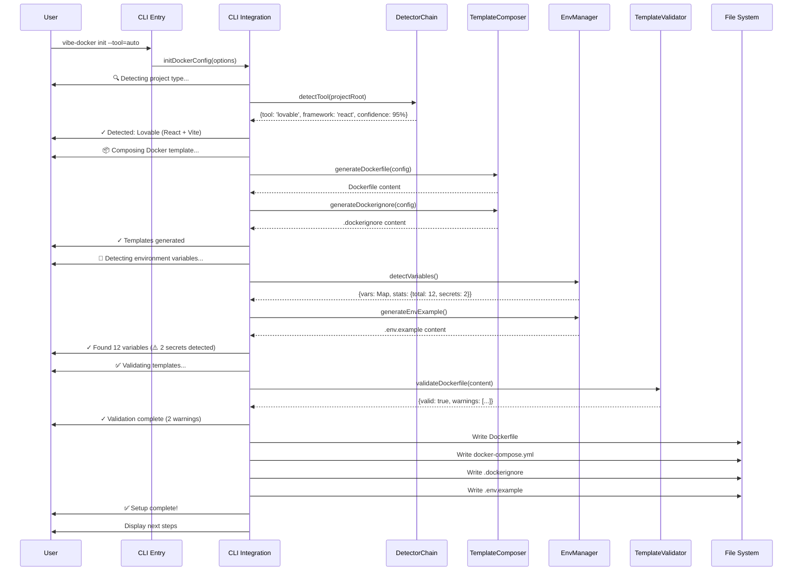

# Phase 3: CLI Integration & Template System Specification

## Executive Summary

This specification defines the requirements for integrating the Phase 2 template composition system (TemplateComposer, EnvManager, TemplateValidator) with the vibe-to-docker CLI. The integration will enable dynamic Docker configuration generation for multiple AI-generated project types with intelligent tool detection, template composition, and environment variable management.

**Document Version**: 1.0
**Date**: 2025-11-12
**Author**: Specification Agent (SPARC Phase)
**Status**: Review Pending

---

## Table of Contents

1. [Current State Analysis](#1-current-state-analysis)
2. [Requirements Specification](#2-requirements-specification)
3. [CLI Command Specification](#3-cli-command-specification)
4. [Integration Architecture](#4-integration-architecture)
5. [API Contracts](#5-api-contracts)
6. [Validation Requirements](#6-validation-requirements)
7. [Error Handling](#7-error-handling)
8. [Success Criteria](#8-success-criteria)
9. [Implementation Roadmap](#9-implementation-roadmap)
10. [Token Budget](#10-token-budget)

---

## 1. Current State Analysis

### 1.1 Existing CLI Implementation

**File**: `vibe-to-docker.js`
**Function**: `copyTemplate()` (lines 895-1059)

**Current Workflow**:
```javascript
1. Validate template name and target directory
2. Ensure .vibe-docker directory structure exists
3. Resolve template path (checks .vibe-docker first, then package templates/)
4. Detect project values (detectProjectValues())
5. Validate template (validateTemplate())
6. Check build compatibility (checkBuildCompatibility())
7. Process template files:
   - Read files from templates/{basic,ui-heavy}/
   - Replace variables using replaceTemplateVariables()
   - Write to .vibe-docker directory
8. Create .env from .env.example if it exists
9. Display setup complete message with port assignments
```

**Current Templates**:
- `templates/basic/` - Minimal Docker setup
- `templates/ui-heavy/` - UI-optimized setup

**Limitations**:
- ❌ Simple file copying, no dynamic composition
- ❌ Only 2 static templates (basic, ui-heavy)
- ❌ No tool-specific template support
- ❌ No EnvManager integration (uses simple .env.example copy)
- ❌ No TemplateComposer integration (uses replaceTemplateVariables())
- ❌ No TemplateValidator security checks
- ❌ Template selection based on manual choice, not tool detection

### 1.2 Phase 2 Template System

**Files Created**:
- `src/lib/template-composer.js` - Template composition engine
- `src/lib/env-manager.js` - Environment variable management
- `src/lib/template-validator.js` - Security and best practices validation

**Templates Created**:
```
src/templates/
├── base/
│   └── Dockerfile.base                    # Multi-stage base template
├── tools/
│   ├── lovable/
│   │   ├── Dockerfile
│   │   ├── Dockerfile.fragment
│   │   ├── docker-compose.yml
│   │   └── README.md
│   ├── bolt/
│   │   ├── Dockerfile
│   │   ├── docker-compose.yml
│   │   └── README.md
│   ├── v0/
│   │   ├── Dockerfile
│   │   ├── docker-compose.yml
│   │   └── README.md
│   └── figma-make/
│       ├── Dockerfile
│       ├── Dockerfile.fragment
│       ├── docker-compose.yml
│       └── README.md
└── fragments/
    ├── frameworks/
    │   ├── react.fragment
    │   ├── nextjs.fragment
    │   ├── vue.dockerfile
    │   ├── svelte.dockerfile
    │   ├── angular.dockerfile
    │   └── remix.dockerfile
    ├── databases/
    │   ├── postgresql.yml
    │   ├── mongodb.yml
    │   ├── redis.yml
    │   ├── mysql.yml
    │   └── supabase.yml
    └── backends/
        ├── express.dockerfile
        ├── fastify.dockerfile
        ├── hono.dockerfile
        └── nestjs.dockerfile
```

**Capabilities**:
- ✅ Dynamic template composition from fragments
- ✅ Variable substitution with {{variable}} syntax
- ✅ Multi-stage Dockerfile generation
- ✅ Environment variable detection and .env file generation
- ✅ Security validation (secrets, non-root user, health checks)
- ✅ Parallel fragment loading with caching
- ✅ Tool-specific templates (lovable, bolt, v0, figma-make)

### 1.3 Phase 1 Detection System

**Files**:
- `src/detectors/` - Tool detection system (DetectorChain)

**Capabilities**:
- ✅ Tool detection (Lovable, Bolt, V0, Figma Make)
- ✅ Framework detection (React, Vue, Next.js, etc.)
- ✅ Build tool detection (Vite, Webpack, etc.)
- ✅ Package manager detection (npm, yarn, pnpm)

### 1.4 Integration Gap

**What needs to happen**:
1. CLI needs to invoke Phase 1 detectors for tool/framework detection
2. CLI needs to call TemplateComposer to generate Dockerfile dynamically
3. CLI needs to call EnvManager to detect and generate .env files
4. CLI needs to call TemplateValidator to check generated templates
5. CLI needs to support `--tool` flag for manual tool selection
6. CLI needs to support auto-detection mode
7. CLI needs to provide progress feedback during generation
8. CLI needs to handle errors gracefully with helpful messages

---

## 2. Requirements Specification

### 2.1 Functional Requirements

#### FR-3.1: Tool Selection and Detection
**Priority**: High
**ID**: FR-3.1

**Requirements**:
- **FR-3.1.1**: CLI MUST accept `--tool` flag with values: `lovable`, `bolt`, `v0`, `figma-make`, `auto`
- **FR-3.1.2**: When `--tool=auto`, CLI MUST invoke Phase 1 DetectorChain for automatic tool detection
- **FR-3.1.3**: When no `--tool` flag provided, CLI MUST prompt user with interactive selection
- **FR-3.1.4**: CLI MUST validate tool selection against supported tools list
- **FR-3.1.5**: CLI MUST display detected tool and confidence score to user

**Acceptance Criteria**:
```gherkin
Given I run "vibe-docker init --tool=lovable"
When the command executes
Then it should use the Lovable template
And display "Detected tool: Lovable"

Given I run "vibe-docker init --tool=auto"
When the command executes
Then it should run DetectorChain
And display detected tool with confidence score
And use the appropriate template

Given I run "vibe-docker init" with no --tool flag
When the command executes
Then it should show interactive menu
And list available tools
And let user select tool
```

#### FR-3.2: Dynamic Template Composition
**Priority**: High
**ID**: FR-3.2

**Requirements**:
- **FR-3.2.1**: CLI MUST use TemplateComposer to generate Dockerfile dynamically
- **FR-3.2.2**: CLI MUST compose templates from base + tool + framework fragments
- **FR-3.2.3**: CLI MUST pass detection metadata to TemplateComposer
- **FR-3.2.4**: CLI MUST generate .dockerignore using TemplateComposer
- **FR-3.2.5**: CLI MUST support custom variable substitution

**Acceptance Criteria**:
```gherkin
Given I have a Lovable project with React + Vite
When I run "vibe-docker init --tool=lovable"
Then it should compose template from:
  - base/Dockerfile.base
  - tools/lovable/Dockerfile.fragment
  - fragments/frameworks/react.fragment
And substitute variables (NODE_VERSION, PORT, etc.)
And generate optimized multi-stage Dockerfile
```

#### FR-3.3: Environment Variable Management
**Priority**: High
**ID**: FR-3.3

**Requirements**:
- **FR-3.3.1**: CLI MUST use EnvManager to detect environment variables in project
- **FR-3.3.2**: CLI MUST generate .env.example with detected variables
- **FR-3.3.3**: CLI MUST create .env if it doesn't exist (copy from .env.example)
- **FR-3.3.4**: CLI MUST separate build-time vs runtime variables
- **FR-3.3.5**: CLI MUST warn user about detected secrets
- **FR-3.3.6**: CLI MUST display environment variable statistics

**Acceptance Criteria**:
```gherkin
Given I have a project with environment variables
When I run "vibe-docker init"
Then it should scan src/ directory for env vars
And generate .env.example with detected variables
And group by build-time / runtime / secrets
And display warning for secret variables
And show statistics (X build-time, Y runtime, Z secrets)
```

#### FR-3.4: Template Validation
**Priority**: Medium
**ID**: FR-3.4

**Requirements**:
- **FR-3.4.1**: CLI MUST validate generated Dockerfile using TemplateValidator
- **FR-3.4.2**: CLI MUST check for security best practices
- **FR-3.4.3**: CLI MUST validate docker-compose.yml if present
- **FR-3.4.4**: CLI MUST display validation warnings to user
- **FR-3.4.5**: CLI MUST NOT block on warnings, only on critical errors

**Acceptance Criteria**:
```gherkin
Given I generate a Dockerfile
When validation runs
Then it should check:
  - Multi-stage build structure
  - Non-root user usage
  - Health check presence
  - No hardcoded secrets
  - Best practices (layer optimization)
And display warnings if issues found
And continue execution unless critical error
```

#### FR-3.5: Progress Feedback
**Priority**: Medium
**ID**: FR-3.5

**Requirements**:
- **FR-3.5.1**: CLI MUST display progress during template generation
- **FR-3.5.2**: CLI MUST show steps: Detection → Composition → Validation → Generation
- **FR-3.5.3**: CLI MUST display spinner or progress indicator
- **FR-3.5.4**: CLI MUST show colored output (success=green, warning=yellow, error=red)
- **FR-3.5.5**: CLI MUST provide verbose mode with `--verbose` flag

**Acceptance Criteria**:
```gherkin
Given I run "vibe-docker init"
When command executes
Then it should display:
  "🔍 Detecting project type..."
  "✓ Detected: Lovable (confidence: 95%)"
  "📦 Composing Docker template..."
  "✓ Dockerfile generated"
  "🔧 Detecting environment variables..."
  "✓ Found 12 variables (8 runtime, 2 build-time, 2 secrets)"
  "✅ Setup complete!"
```

#### FR-3.6: Backward Compatibility
**Priority**: High
**ID**: FR-3.6

**Requirements**:
- **FR-3.6.1**: CLI MUST support existing `basic` and `ui-heavy` template names
- **FR-3.6.2**: CLI MUST maintain compatibility with old templates/ directory
- **FR-3.6.3**: CLI MUST map `basic` → auto-detection with minimal template
- **FR-3.6.4**: CLI MUST map `ui-heavy` → auto-detection with UI optimizations
- **FR-3.6.5**: CLI MUST NOT break existing user workflows

**Acceptance Criteria**:
```gherkin
Given I run "vibe-docker basic" (old command)
When command executes
Then it should work as before
And use new system internally
And display deprecation notice
And suggest "vibe-docker init --tool=auto"
```

### 2.2 Non-Functional Requirements

#### NFR-3.1: Performance
**Priority**: High
**ID**: NFR-3.1

**Requirements**:
- **NFR-3.1.1**: Template composition MUST complete in <500ms for simple projects
- **NFR-3.1.2**: Environment variable detection MUST complete in <1s for 100 files
- **NFR-3.1.3**: Template validation MUST complete in <200ms
- **NFR-3.1.4**: Total CLI execution time MUST be <3s for typical project
- **NFR-3.1.5**: Fragment caching MUST achieve >80% cache hit rate on repeated runs

**Measurement**:
```javascript
// Performance benchmarks
const benchmarks = {
  templateComposition: '<500ms',
  envDetection: '<1s (100 files)',
  templateValidation: '<200ms',
  totalExecution: '<3s',
  cacheHitRate: '>80%'
};
```

#### NFR-3.2: Reliability
**Priority**: High
**ID**: NFR-3.2

**Requirements**:
- **NFR-3.2.1**: CLI MUST handle missing templates gracefully
- **NFR-3.2.2**: CLI MUST handle network failures (if fetching remote templates)
- **NFR-3.2.3**: CLI MUST provide atomic operations (complete or rollback)
- **NFR-3.2.4**: CLI MUST NOT corrupt existing .vibe-docker directory
- **NFR-3.2.5**: CLI MUST validate all inputs before processing

**Error Scenarios**:
- Template file not found → Fallback to base template + warn user
- Environment variable detection fails → Continue without env file + warn user
- Validation fails → Display errors + ask user to confirm or abort
- File write fails → Rollback all changes + display error

#### NFR-3.3: Usability
**Priority**: Medium
**ID**: NFR-3.3

**Requirements**:
- **NFR-3.3.1**: CLI MUST provide helpful error messages with suggestions
- **NFR-3.3.2**: CLI MUST display clear progress indicators
- **NFR-3.3.3**: CLI MUST provide colored output for readability
- **NFR-3.3.4**: CLI MUST support `--help` flag for all commands
- **NFR-3.3.5**: CLI MUST provide examples in help text

**User Experience**:
```bash
# Good error message
❌ Error: Template 'lovable' not found
💡 Suggestion: Available tools are: lovable, bolt, v0, figma-make
💡 Try: vibe-docker init --tool=auto (auto-detect)

# Good progress indicator
🔍 Detecting project type...
✓ Detected: Lovable (React + Vite + Supabase)
📦 Composing Docker template...
  ├─ Loading base template
  ├─ Loading Lovable fragments
  └─ Substituting variables
✓ Dockerfile generated
```

#### NFR-3.4: Maintainability
**Priority**: Medium
**ID**: NFR-3.4

**Requirements**:
- **NFR-3.4.1**: Integration code MUST be modular and testable
- **NFR-3.4.2**: Integration code MUST follow existing project patterns
- **NFR-3.4.3**: Integration code MUST have 100% test coverage
- **NFR-3.4.4**: Integration code MUST be well-documented with JSDoc
- **NFR-3.4.5**: Integration code MUST use ES modules (import/export)

**Code Quality**:
- Cyclomatic complexity: <10 per function
- Test coverage: 100% for new integration code
- Documentation: JSDoc comments for all public APIs
- File size: <500 lines per module

---

## 3. CLI Command Specification

### 3.1 Primary Command: `vibe-docker init`

#### Syntax
```bash
vibe-docker init [options]
```

#### Options

| Option | Type | Default | Description |
|--------|------|---------|-------------|
| `--tool` | string | `auto` | Tool type: `lovable`, `bolt`, `v0`, `figma-make`, `auto` |
| `--framework` | string | auto-detect | Override framework detection: `react`, `vue`, `nextjs`, etc. |
| `--template-dir` | string | `.vibe-docker` | Output directory for Docker files |
| `--env-scan` | boolean | `true` | Enable environment variable detection |
| `--validate` | boolean | `true` | Enable template validation |
| `--verbose` | boolean | `false` | Show detailed output |
| `--force` | boolean | `false` | Overwrite existing files |
| `--dry-run` | boolean | `false` | Show what would be generated without writing |
| `--help` | boolean | - | Show help message |

#### Examples

**Auto-detection (recommended)**:
```bash
vibe-docker init --tool=auto
```

**Explicit tool selection**:
```bash
vibe-docker init --tool=lovable
vibe-docker init --tool=bolt
vibe-docker init --tool=v0
vibe-docker init --tool=figma-make
```

**Override framework**:
```bash
vibe-docker init --tool=lovable --framework=nextjs
```

**Dry run (preview without writing)**:
```bash
vibe-docker init --tool=auto --dry-run
```

**Force overwrite**:
```bash
vibe-docker init --tool=lovable --force
```

**Verbose output**:
```bash
vibe-docker init --tool=auto --verbose
```

**Skip environment variable detection**:
```bash
vibe-docker init --tool=auto --env-scan=false
```

### 3.2 Legacy Command Support

#### `vibe-docker basic` (deprecated)
```bash
vibe-docker basic [target-dir]
```

**Behavior**:
1. Display deprecation notice
2. Map to `vibe-docker init --tool=auto --template=minimal`
3. Use auto-detection
4. Generate minimal Docker configuration
5. Suggest new command format

**Deprecation Message**:
```
⚠️  Warning: "vibe-docker basic" is deprecated
💡 Use: vibe-docker init --tool=auto
🔄 Redirecting to new command...
```

#### `vibe-docker ui-heavy` (deprecated)
```bash
vibe-docker ui-heavy [target-dir]
```

**Behavior**:
1. Display deprecation notice
2. Map to `vibe-docker init --tool=auto --template=ui-optimized`
3. Use auto-detection with UI optimizations
4. Generate UI-optimized Docker configuration

### 3.3 Interactive Mode

When no `--tool` flag is provided:

```bash
vibe-docker init
```

**Interactive Prompts**:
```
? Select your project type:
  > Auto-detect (recommended)
    Lovable (React + Vite + Supabase)
    Bolt (Remix + Vite + TypeScript)
    V0 (Next.js + shadcn/ui)
    Figma Make (React + Vite)

? Scan for environment variables? (Y/n)
? Enable template validation? (Y/n)
? Output directory: (.vibe-docker)
```

---

## 4. Integration Architecture

### 4.1 System Architecture Diagram

```
┌─────────────────────────────────────────────────────────────────┐
│                         CLI Entry Point                          │
│                     (vibe-to-docker.js)                         │
└──────────────────────┬──────────────────────────────────────────┘
                       │
                       ├─── Parse CLI arguments (--tool, --framework, etc.)
                       │
                       ├─── Validate inputs
                       │
                       └─── Call initCommand()
                            │
                            v
┌─────────────────────────────────────────────────────────────────┐
│                      Integration Layer                           │
│               (NEW: src/lib/cli-integration.js)                 │
└──────────────────────┬──────────────────────────────────────────┘
                       │
        ┌──────────────┼──────────────┬──────────────┐
        │              │              │              │
        v              v              v              v
┌──────────────┐ ┌──────────────┐ ┌──────────────┐ ┌──────────────┐
│  Phase 1:    │ │  Phase 2:    │ │  Phase 2:    │ │  Phase 2:    │
│  Detector    │ │  Template    │ │  EnvManager  │ │  Template    │
│  Chain       │ │  Composer    │ │              │ │  Validator   │
└──────────────┘ └──────────────┘ └──────────────┘ └──────────────┘
        │              │              │              │
        └──────────────┴──────────────┴──────────────┘
                       │
                       v
┌─────────────────────────────────────────────────────────────────┐
│                     File Generation                              │
│     - Dockerfile (multi-stage, optimized)                       │
│     - docker-compose.yml                                        │
│     - .dockerignore                                             │
│     - .env.example                                              │
│     - .env (if missing)                                         │
│     - README.md (Docker usage)                                  │
└─────────────────────────────────────────────────────────────────┘
```

### 4.2 Integration Layer Design

**New File**: `src/lib/cli-integration.js`

This module orchestrates the integration between CLI and Phase 2 system.

**Responsibilities**:
1. Coordinate detection, composition, and validation
2. Handle CLI-specific logic (progress display, user prompts)
3. Manage file I/O for generated templates
4. Provide unified error handling
5. Format output for CLI display

**Key Functions**:
```javascript
/**
 * Initialize Docker configuration for project
 * @param {Object} options - CLI options
 * @returns {Promise<Object>} Generation result
 */
async function initDockerConfig(options);

/**
 * Detect project tool and framework
 * @param {string} projectRoot
 * @param {string} toolHint - Optional tool override
 * @returns {Promise<Object>} Detection result
 */
async function detectProject(projectRoot, toolHint);

/**
 * Generate Docker templates using Phase 2 system
 * @param {Object} detectionResult
 * @param {Object} options
 * @returns {Promise<Object>} Generated templates
 */
async function generateTemplates(detectionResult, options);

/**
 * Write generated templates to filesystem
 * @param {Object} templates
 * @param {string} outputDir
 * @param {Object} options
 * @returns {Promise<void>}
 */
async function writeTemplates(templates, outputDir, options);

/**
 * Display generation results to user
 * @param {Object} result
 */
function displayResults(result);
```

### 4.3 Workflow Sequence



### 4.4 Data Flow

```
CLI Input
  └─> {tool?, framework?, options}
      │
      v
┌─────────────────────────────┐
│ 1. Tool Detection           │
│    (Phase 1 DetectorChain)  │
└─────────────┬───────────────┘
              │
              v
        Detection Result
        {
          tool: 'lovable',
          framework: 'react',
          buildTool: 'vite',
          packageManager: 'npm',
          hasBackend: false,
          hasDatabase: true,
          database: 'supabase',
          confidence: 95%,
          metadata: {...}
        }
              │
              v
┌─────────────────────────────┐
│ 2. Template Composition     │
│    (Phase 2 TemplateComposer│
└─────────────┬───────────────┘
              │
              v
        Composed Templates
        {
          dockerfile: '...',
          dockerignore: '...',
          dockerCompose: '...'
        }
              │
              v
┌─────────────────────────────┐
│ 3. Environment Detection    │
│    (Phase 2 EnvManager)     │
└─────────────┬───────────────┘
              │
              v
        Environment Data
        {
          variables: Map<string, Object>,
          envExample: '...',
          stats: {total, buildTime, runtime, secrets},
          warnings: [...]
        }
              │
              v
┌─────────────────────────────┐
│ 4. Template Validation      │
│    (Phase 2 TemplateValidator)
└─────────────┬───────────────┘
              │
              v
        Validation Result
        {
          valid: true,
          errors: [],
          warnings: [...],
          recommendations: [...]
        }
              │
              v
┌─────────────────────────────┐
│ 5. File Generation          │
│    (Write to .vibe-docker/) │
└─────────────────────────────┘
```

---

## 5. API Contracts

### 5.1 CLI Integration Module

**File**: `src/lib/cli-integration.js`

#### Interface: `initDockerConfig(options)`

**Purpose**: Main entry point for Docker configuration initialization

**Input**:
```typescript
interface InitOptions {
  tool?: 'lovable' | 'bolt' | 'v0' | 'figma-make' | 'auto';
  framework?: string;
  projectRoot?: string;
  templateDir?: string;
  envScan?: boolean;
  validate?: boolean;
  verbose?: boolean;
  force?: boolean;
  dryRun?: boolean;
}
```

**Output**:
```typescript
interface InitResult {
  success: boolean;
  detection: DetectionResult;
  templates: GeneratedTemplates;
  environment: EnvironmentData;
  validation: ValidationResult;
  filesWritten: string[];
  errors: string[];
  warnings: string[];
}
```

**Errors**:
- `ProjectNotFoundError`: Project root directory doesn't exist
- `ToolDetectionError`: Failed to detect tool type
- `TemplateCompositionError`: Failed to compose templates
- `FileWriteError`: Failed to write generated files
- `ValidationError`: Critical validation errors (only if validation is blocking)

#### Interface: `detectProject(projectRoot, toolHint?)`

**Purpose**: Detect project tool and framework

**Input**:
```typescript
interface DetectProjectInput {
  projectRoot: string;
  toolHint?: string;  // Optional override
}
```

**Output**:
```typescript
interface DetectionResult {
  tool: string;
  framework: string;
  buildTool: string;
  packageManager: string;
  hasBackend: boolean;
  hasDatabase: boolean;
  database?: string;
  confidence: number;  // 0-100
  metadata: {
    nodeVersion?: string;
    port?: number;
    buildCommand?: string;
    startCommand?: string;
    installCommand?: string;
  };
}
```

**Behavior**:
- If `toolHint` provided, validate and use it (skip detection)
- If `toolHint='auto'`, run full DetectorChain
- Return confidence score with detection result
- Throw error if detection fails and no fallback available

#### Interface: `generateTemplates(detectionResult, options)`

**Purpose**: Generate Docker templates using Phase 2 system

**Input**:
```typescript
interface GenerateTemplatesInput {
  detection: DetectionResult;
  options: {
    customVariables?: Record<string, string>;
    includeDockerCompose?: boolean;
    includeNginx?: boolean;
    multiStage?: boolean;
  };
}
```

**Output**:
```typescript
interface GeneratedTemplates {
  dockerfile: string;
  dockerignore: string;
  dockerCompose?: string;
  nginx?: string;
  readme?: string;
}
```

**Behavior**:
- Use TemplateComposer to generate Dockerfile
- Compose from base + tool + framework fragments
- Substitute variables from detection metadata
- Generate docker-compose.yml if backend/database detected
- Generate nginx.conf if web server needed

#### Interface: `writeTemplates(templates, outputDir, options)`

**Purpose**: Write generated templates to filesystem

**Input**:
```typescript
interface WriteTemplatesInput {
  templates: GeneratedTemplates;
  outputDir: string;
  options: {
    force?: boolean;     // Overwrite existing files
    dryRun?: boolean;    // Don't actually write
    atomic?: boolean;    // Rollback on any failure
  };
}
```

**Output**:
```typescript
interface WriteTemplatesResult {
  filesWritten: string[];
  filesSkipped: string[];
  errors: string[];
}
```

**Behavior**:
- Create output directory if it doesn't exist
- Check for existing files (skip if exists and !force)
- Write files atomically (all or nothing if atomic=true)
- Return list of written and skipped files
- Rollback on failure if atomic=true

### 5.2 Phase 2 System Integration

#### TemplateComposer Integration

**Usage**:
```javascript
import { TemplateComposer } from './lib/template-composer.js';

const composer = new TemplateComposer();

// Generate Dockerfile
const dockerfile = await composer.generateDockerfile({
  tool: 'lovable',
  framework: 'react',
  metadata: {
    nodeVersion: '20',
    port: 3000,
    buildCommand: 'npm run build',
    startCommand: 'npm start'
  },
  variables: {
    CUSTOM_VAR: 'value'
  }
});

// Generate .dockerignore
const dockerignore = await composer.generateDockerignore({
  tool: 'lovable',
  additionalPatterns: ['*.log', 'tmp/']
});
```

#### EnvManager Integration

**Usage**:
```javascript
import { EnvManager } from './lib/env-manager.js';

const envManager = new EnvManager(projectRoot);

// Detect environment variables
const variables = await envManager.detectVariables({
  extensions: ['.js', '.jsx', '.ts', '.tsx'],
  directories: ['src'],
  maxFiles: 100
});

// Generate .env.example
const envExample = envManager.generateEnvExample({
  variables,
  includeComments: true,
  groupByType: true
});

// Get validation warnings
const warnings = envManager.validateVariables();

// Get statistics
const stats = envManager.getStats();
```

#### TemplateValidator Integration

**Usage**:
```javascript
import { TemplateValidator } from './lib/template-validator.js';

const validator = new TemplateValidator();

// Validate Dockerfile
const dockerfileValidation = validator.validateDockerfile(dockerfileContent);
if (!dockerfileValidation.valid) {
  console.error('Errors:', dockerfileValidation.errors);
}
if (dockerfileValidation.warnings.length > 0) {
  console.warn('Warnings:', dockerfileValidation.warnings);
}

// Check best practices
const bestPractices = validator.checkBestPractices(dockerfileContent);
console.log('Recommendations:', bestPractices.recommendations);
```

---

## 6. Validation Requirements

### 6.1 Input Validation

**CLI Arguments**:
```javascript
function validateCliOptions(options) {
  const errors = [];

  // Validate tool
  if (options.tool && !['lovable', 'bolt', 'v0', 'figma-make', 'auto'].includes(options.tool)) {
    errors.push(`Invalid tool: ${options.tool}. Must be one of: lovable, bolt, v0, figma-make, auto`);
  }

  // Validate framework
  if (options.framework && !SUPPORTED_FRAMEWORKS.includes(options.framework)) {
    errors.push(`Invalid framework: ${options.framework}`);
  }

  // Validate directories
  if (options.projectRoot && !fs.existsSync(options.projectRoot)) {
    errors.push(`Project root not found: ${options.projectRoot}`);
  }

  if (options.templateDir && !isValidPath(options.templateDir)) {
    errors.push(`Invalid template directory: ${options.templateDir}`);
  }

  return { valid: errors.length === 0, errors };
}
```

### 6.2 Template Validation

**Generated Templates**:
```javascript
function validateGeneratedTemplates(templates) {
  const validator = new TemplateValidator();
  const results = {
    dockerfile: validator.validateDockerfile(templates.dockerfile),
    dockerCompose: templates.dockerCompose
      ? validator.validateDockerCompose(templates.dockerCompose)
      : { valid: true, errors: [], warnings: [] }
  };

  // Aggregate errors and warnings
  const allErrors = [
    ...results.dockerfile.errors,
    ...results.dockerCompose.errors
  ];

  const allWarnings = [
    ...results.dockerfile.warnings,
    ...results.dockerCompose.warnings
  ];

  return {
    valid: allErrors.length === 0,
    errors: allErrors,
    warnings: allWarnings
  };
}
```

### 6.3 Environment Variable Validation

**Security Checks**:
```javascript
function validateEnvironmentVariables(envManager) {
  const warnings = envManager.validateVariables();

  // Categorize by severity
  const critical = warnings.filter(w => w.severity === 'critical');
  const high = warnings.filter(w => w.severity === 'high');
  const medium = warnings.filter(w => w.severity === 'medium');
  const low = warnings.filter(w => w.severity === 'low');

  // Display warnings to user
  if (critical.length > 0) {
    console.error('❌ Critical security issues:');
    critical.forEach(w => console.error(`  - ${w.message}`));
  }

  if (high.length > 0) {
    console.warn('⚠️  High priority warnings:');
    high.forEach(w => console.warn(`  - ${w.message}`));
  }

  return {
    hasCritical: critical.length > 0,
    warnings
  };
}
```

### 6.4 File System Validation

**Before Writing**:
```javascript
function validateFileSystem(outputDir, options) {
  const checks = [];

  // Check output directory exists or can be created
  if (!fs.existsSync(outputDir)) {
    try {
      fs.mkdirSync(outputDir, { recursive: true });
      checks.push({ type: 'info', message: `Created directory: ${outputDir}` });
    } catch (error) {
      checks.push({ type: 'error', message: `Cannot create directory: ${outputDir}` });
    }
  }

  // Check for existing files
  const filesToWrite = ['Dockerfile', 'docker-compose.yml', '.dockerignore', '.env.example'];
  const existingFiles = filesToWrite.filter(file =>
    fs.existsSync(path.join(outputDir, file))
  );

  if (existingFiles.length > 0 && !options.force) {
    checks.push({
      type: 'warning',
      message: `Files already exist: ${existingFiles.join(', ')}. Use --force to overwrite.`
    });
  }

  // Check write permissions
  try {
    fs.accessSync(outputDir, fs.constants.W_OK);
  } catch (error) {
    checks.push({
      type: 'error',
      message: `No write permission for directory: ${outputDir}`
    });
  }

  return checks;
}
```

---

## 7. Error Handling

### 7.1 Error Categories

#### Category 1: User Input Errors
**Examples**:
- Invalid tool name
- Invalid project directory
- Invalid CLI flags

**Handling**:
```javascript
class InvalidToolError extends Error {
  constructor(tool, validTools) {
    super(`Invalid tool: ${tool}`);
    this.name = 'InvalidToolError';
    this.tool = tool;
    this.validTools = validTools;
    this.suggestion = `Valid tools are: ${validTools.join(', ')}`;
  }
}

// Usage
try {
  validateTool(options.tool);
} catch (error) {
  if (error instanceof InvalidToolError) {
    console.error(`❌ ${error.message}`);
    console.error(`💡 ${error.suggestion}`);
    process.exit(1);
  }
}
```

#### Category 2: Detection Errors
**Examples**:
- Cannot detect project type
- Low confidence detection
- Conflicting detection signals

**Handling**:
```javascript
class ToolDetectionError extends Error {
  constructor(message, detectionResult) {
    super(message);
    this.name = 'ToolDetectionError';
    this.detectionResult = detectionResult;
  }
}

// Usage
try {
  const detection = await detectProject(projectRoot);

  if (detection.confidence < 50) {
    throw new ToolDetectionError(
      'Low confidence detection',
      detection
    );
  }
} catch (error) {
  if (error instanceof ToolDetectionError) {
    console.warn(`⚠️  ${error.message}`);
    console.warn(`💡 Detected: ${error.detectionResult.tool} (${error.detectionResult.confidence}% confidence)`);
    console.warn(`💡 You can override with: --tool=<tool-name>`);

    // Ask user to confirm or override
    const confirmed = await promptUser('Continue with detected tool?');
    if (!confirmed) {
      process.exit(1);
    }
  }
}
```

#### Category 3: Template Generation Errors
**Examples**:
- Template file not found
- Fragment composition fails
- Variable substitution fails

**Handling**:
```javascript
class TemplateCompositionError extends Error {
  constructor(message, context) {
    super(message);
    this.name = 'TemplateCompositionError';
    this.context = context;
  }
}

// Usage
try {
  const dockerfile = await composer.generateDockerfile(config);
} catch (error) {
  if (error instanceof TemplateCompositionError) {
    console.error(`❌ Template generation failed: ${error.message}`);
    console.error(`💡 Context: ${JSON.stringify(error.context, null, 2)}`);

    // Fallback to basic template
    console.warn(`🔄 Falling back to basic template...`);
    const basicDockerfile = await generateBasicTemplate(config);
  }
}
```

#### Category 4: File System Errors
**Examples**:
- Cannot write file (permissions)
- Disk full
- File already exists (and !force)

**Handling**:
```javascript
class FileWriteError extends Error {
  constructor(filePath, originalError) {
    super(`Failed to write file: ${filePath}`);
    this.name = 'FileWriteError';
    this.filePath = filePath;
    this.originalError = originalError;
  }
}

// Usage with atomic operations
try {
  await writeTemplatesAtomically(templates, outputDir);
} catch (error) {
  if (error instanceof FileWriteError) {
    console.error(`❌ ${error.message}`);
    console.error(`💡 Reason: ${error.originalError.message}`);

    // Rollback
    console.warn(`🔄 Rolling back changes...`);
    await rollbackWrites(outputDir);

    process.exit(1);
  }
}
```

### 7.2 Error Recovery Strategies

#### Strategy 1: Graceful Degradation
```javascript
async function generateWithFallback(config) {
  try {
    // Try Phase 2 system
    return await generateTemplates(config);
  } catch (error) {
    console.warn(`⚠️  Phase 2 generation failed: ${error.message}`);
    console.warn(`🔄 Falling back to legacy template system...`);

    // Fallback to old copyTemplate()
    return await legacyCopyTemplate(config);
  }
}
```

#### Strategy 2: Atomic Operations with Rollback
```javascript
async function writeTemplatesAtomically(templates, outputDir) {
  const writtenFiles = [];

  try {
    for (const [filename, content] of Object.entries(templates)) {
      const filePath = path.join(outputDir, filename);
      await fs.writeFile(filePath, content);
      writtenFiles.push(filePath);
    }
  } catch (error) {
    // Rollback: delete all written files
    for (const filePath of writtenFiles) {
      try {
        await fs.unlink(filePath);
      } catch (cleanupError) {
        console.error(`Failed to cleanup: ${filePath}`);
      }
    }

    throw new FileWriteError(filePath, error);
  }
}
```

#### Strategy 3: User Confirmation for Warnings
```javascript
async function handleValidationWarnings(warnings) {
  if (warnings.length === 0) return true;

  console.warn(`⚠️  Found ${warnings.length} validation warnings:`);
  warnings.forEach((w, i) => {
    console.warn(`  ${i + 1}. ${w.message}`);
  });

  // Non-interactive mode: continue
  if (!process.stdout.isTTY) {
    console.warn(`💡 Continuing in non-interactive mode...`);
    return true;
  }

  // Interactive mode: ask user
  const answer = await promptUser('Continue despite warnings? (Y/n)');
  return answer !== 'n';
}
```

### 7.3 Error Message Guidelines

**Good Error Messages**:
```
✅ Good:
❌ Error: Template 'lovable' not found
💡 Available templates: lovable, bolt, v0, figma-make
💡 Try: vibe-docker init --tool=auto

❌ Bad:
Error: ENOENT: no such file or directory
```

**Components of Good Error Messages**:
1. **Clear Problem Statement**: What went wrong?
2. **Context**: Where/when did it happen?
3. **Actionable Suggestion**: How to fix it?
4. **Visual Cues**: Use emoji and colors for readability

**Error Message Template**:
```javascript
function formatError(error) {
  return [
    `❌ Error: ${error.message}`,
    error.context ? `📍 Context: ${error.context}` : null,
    error.suggestion ? `💡 Suggestion: ${error.suggestion}` : null,
    error.documentation ? `📚 See: ${error.documentation}` : null
  ].filter(Boolean).join('\n');
}
```

---

## 8. Success Criteria

### 8.1 Functional Success Criteria

#### SC-F1: Tool Detection and Selection
**Status**: Required
**Priority**: High

**Criteria**:
- ✅ CLI accepts `--tool` flag with values: lovable, bolt, v0, figma-make, auto
- ✅ Auto-detection works for all 4 supported tools
- ✅ Detection confidence score displayed to user
- ✅ Manual tool override works correctly
- ✅ Interactive mode shows tool selection menu

**Test Cases**:
```bash
# Auto-detection
vibe-docker init --tool=auto
# Expected: Detects tool, displays confidence, generates templates

# Explicit tool
vibe-docker init --tool=lovable
# Expected: Uses Lovable template, skips detection

# Interactive mode
vibe-docker init
# Expected: Shows menu, user selects tool, generates templates
```

#### SC-F2: Template Composition
**Status**: Required
**Priority**: High

**Criteria**:
- ✅ Dockerfile generated using TemplateComposer
- ✅ Multi-stage Dockerfile structure (build + runtime stages)
- ✅ Correct fragments loaded (base + tool + framework)
- ✅ Variables substituted correctly
- ✅ .dockerignore generated
- ✅ docker-compose.yml generated (when applicable)

**Test Cases**:
```bash
# Lovable project (React + Vite + Supabase)
vibe-docker init --tool=lovable
# Expected: Dockerfile with Lovable + React + Vite fragments

# Bolt project (Remix + Vite)
vibe-docker init --tool=bolt
# Expected: Dockerfile with Bolt + Remix fragments
```

#### SC-F3: Environment Variable Management
**Status**: Required
**Priority**: High

**Criteria**:
- ✅ Environment variables detected in src/ directory
- ✅ .env.example generated with all detected variables
- ✅ Variables grouped by build-time / runtime / secrets
- ✅ Secret variables identified and warned
- ✅ .env created from .env.example if missing
- ✅ Statistics displayed to user

**Test Cases**:
```bash
# Project with env variables
vibe-docker init --tool=lovable
# Expected:
#   - Scans src/ for process.env.* and import.meta.env.*
#   - Generates .env.example with groups
#   - Displays stats and warnings
```

#### SC-F4: Template Validation
**Status**: Required
**Priority**: Medium

**Criteria**:
- ✅ Dockerfile validated for syntax and best practices
- ✅ Security checks performed (non-root user, no hardcoded secrets)
- ✅ Warnings displayed to user
- ✅ Critical errors block generation
- ✅ Warnings don't block generation

**Test Cases**:
```bash
# Generated Dockerfile
vibe-docker init --tool=lovable --validate
# Expected:
#   - Checks multi-stage build
#   - Checks non-root user
#   - Checks health check
#   - Displays warnings
```

#### SC-F5: Backward Compatibility
**Status**: Required
**Priority**: High

**Criteria**:
- ✅ `vibe-docker basic` command still works
- ✅ `vibe-docker ui-heavy` command still works
- ✅ Legacy commands show deprecation notice
- ✅ Legacy commands mapped to new system
- ✅ Existing users' workflows not broken

**Test Cases**:
```bash
# Legacy command
vibe-docker basic
# Expected:
#   - Shows deprecation notice
#   - Maps to vibe-docker init --tool=auto
#   - Generates templates
#   - Works as before
```

### 8.2 Non-Functional Success Criteria

#### SC-NF1: Performance
**Status**: Required
**Priority**: High

**Criteria**:
- ✅ Template composition completes in <500ms
- ✅ Environment variable detection completes in <1s (100 files)
- ✅ Template validation completes in <200ms
- ✅ Total CLI execution time <3s for typical project
- ✅ Fragment cache hit rate >80% on repeated runs

**Measurement**:
```bash
# Benchmark script
time vibe-docker init --tool=lovable
# Target: real < 3s

# Run twice to test caching
vibe-docker init --tool=lovable  # Cold run
vibe-docker init --tool=lovable --force  # Warm run (cached)
# Target: Warm run 2x faster than cold run
```

#### SC-NF2: Reliability
**Status**: Required
**Priority**: High

**Criteria**:
- ✅ CLI handles missing templates gracefully
- ✅ Atomic file operations (complete or rollback)
- ✅ No corruption of existing .vibe-docker directory
- ✅ All inputs validated before processing
- ✅ Error recovery mechanisms work

**Test Cases**:
```bash
# Missing template
rm -rf src/templates/tools/lovable
vibe-docker init --tool=lovable
# Expected: Falls back to base template + warns user

# Interrupted operation (Ctrl+C during write)
vibe-docker init --tool=lovable
# Press Ctrl+C during file write
# Expected: Rollback, no partial files left
```

#### SC-NF3: Usability
**Status**: Required
**Priority**: Medium

**Criteria**:
- ✅ Helpful error messages with suggestions
- ✅ Clear progress indicators
- ✅ Colored output (green=success, yellow=warning, red=error)
- ✅ --help flag shows comprehensive usage
- ✅ Examples included in help text

**Test Cases**:
```bash
# Help text
vibe-docker init --help
# Expected: Shows usage, options, examples

# Error message quality
vibe-docker init --tool=invalid
# Expected:
#   ❌ Error: Invalid tool: invalid
#   💡 Valid tools: lovable, bolt, v0, figma-make
#   💡 Try: vibe-docker init --tool=auto
```

#### SC-NF4: Maintainability
**Status**: Required
**Priority**: Medium

**Criteria**:
- ✅ Integration code is modular (separate concerns)
- ✅ 100% test coverage for new integration code
- ✅ JSDoc comments for all public APIs
- ✅ ES modules used consistently
- ✅ Code follows existing project patterns

**Measurement**:
```bash
# Test coverage
npm test -- --coverage
# Target: 100% for src/lib/cli-integration.js

# JSDoc coverage
# Check: All public functions have JSDoc

# Code quality
npm run lint
# Target: 0 errors
```

### 8.3 Acceptance Testing Checklist

#### End-to-End Test Scenarios

**Test 1: Lovable Project (Happy Path)**
```bash
# Setup: Clone Lovable example project
cd lovable-example-project

# Execute
vibe-docker init --tool=lovable

# Verify
✅ Dockerfile exists in .vibe-docker/
✅ docker-compose.yml exists
✅ .dockerignore exists
✅ .env.example exists with detected variables
✅ Dockerfile has multi-stage build
✅ Dockerfile includes Supabase configuration
✅ No errors displayed
✅ Success message shown
```

**Test 2: Auto-Detection (Multiple Tools)**
```bash
# Test each tool's auto-detection
for tool in lovable bolt v0 figma-make; do
  cd ${tool}-example-project
  vibe-docker init --tool=auto
  # Verify: Detected tool matches expected
done
```

**Test 3: Environment Variable Detection**
```bash
# Setup: Project with multiple env variables
cd project-with-envs

# Execute
vibe-docker init --tool=auto

# Verify
✅ .env.example contains all detected variables
✅ Variables grouped: build-time, runtime, secrets
✅ Warning shown for secret variables
✅ Statistics displayed
```

**Test 4: Validation Warnings**
```bash
# Setup: Project with validation issues
cd project-with-issues

# Execute
vibe-docker init --tool=auto

# Verify
✅ Warnings displayed
✅ Generation continues (non-blocking)
✅ Recommendations shown
```

**Test 5: Legacy Command Compatibility**
```bash
# Execute legacy commands
vibe-docker basic
vibe-docker ui-heavy

# Verify
✅ Deprecation notice shown
✅ Templates generated successfully
✅ Mapped to new system
✅ User workflows not broken
```

**Test 6: Error Handling**
```bash
# Test various error scenarios
vibe-docker init --tool=invalid  # Invalid tool
vibe-docker init --tool=lovable  # In non-project directory
vibe-docker init --tool=auto     # In empty directory

# Verify
✅ Clear error messages
✅ Actionable suggestions
✅ Graceful failure
```

---

## 9. Implementation Roadmap

### 9.1 Implementation Phases

#### Phase 3.1: Core Integration (Week 1)
**Token Budget**: 15,000 tokens
**Priority**: High

**Tasks**:
1. Create `src/lib/cli-integration.js` module
   - Implement `initDockerConfig(options)`
   - Implement `detectProject(projectRoot, toolHint)`
   - Implement `generateTemplates(detectionResult, options)`
   - Implement `writeTemplates(templates, outputDir, options)`

2. Integrate Phase 1 DetectorChain
   - Import and configure DetectorChain
   - Handle detection results
   - Map detection to template config

3. Integrate Phase 2 TemplateComposer
   - Import and configure TemplateComposer
   - Pass detection results to composer
   - Handle composed templates

4. Basic CLI updates in `vibe-to-docker.js`
   - Add `--tool` flag parsing
   - Add `init` command
   - Call integration layer

**Deliverables**:
- ✅ `src/lib/cli-integration.js` (functional)
- ✅ Basic `vibe-docker init --tool=lovable` works
- ✅ Auto-detection works
- ✅ Unit tests for integration module

#### Phase 3.2: Environment & Validation (Week 1-2)
**Token Budget**: 8,000 tokens
**Priority**: High

**Tasks**:
1. Integrate EnvManager
   - Add environment variable detection
   - Generate .env.example
   - Display statistics and warnings

2. Integrate TemplateValidator
   - Add Dockerfile validation
   - Add docker-compose.yml validation
   - Display validation results

3. Error handling
   - Implement error classes
   - Add recovery strategies
   - Add rollback mechanisms

**Deliverables**:
- ✅ Environment variable detection works
- ✅ .env.example generated correctly
- ✅ Template validation runs
- ✅ Error handling robust

#### Phase 3.3: User Experience (Week 2)
**Token Budget**: 6,000 tokens
**Priority**: Medium

**Tasks**:
1. Progress indicators
   - Add spinners / progress bars
   - Add step-by-step feedback
   - Add colored output

2. Interactive mode
   - Add tool selection menu
   - Add confirmation prompts
   - Add help text

3. Verbose mode
   - Add `--verbose` flag
   - Add detailed logging
   - Add debug information

**Deliverables**:
- ✅ Progress indicators working
- ✅ Interactive mode functional
- ✅ User-friendly output

#### Phase 3.4: Backward Compatibility & Polish (Week 2)
**Token Budget**: 4,000 tokens
**Priority**: Medium

**Tasks**:
1. Legacy command support
   - Map `basic` to new system
   - Map `ui-heavy` to new system
   - Add deprecation notices

2. CLI flags
   - Add `--framework` override
   - Add `--force` flag
   - Add `--dry-run` flag
   - Add `--help` improvements

3. Documentation
   - Update README.md
   - Add CLI usage guide
   - Add examples

**Deliverables**:
- ✅ Legacy commands work
- ✅ All CLI flags functional
- ✅ Documentation complete

#### Phase 3.5: Testing & Validation (Week 2-3)
**Token Budget**: 12,000 tokens
**Priority**: High

**Tasks**:
1. Unit tests
   - Test all integration module functions
   - Test error handling
   - Test validation logic
   - Target: 100% coverage

2. Integration tests
   - Test with real projects (4 tools)
   - Test auto-detection
   - Test template generation
   - Test environment detection

3. End-to-end tests
   - Test complete workflows
   - Test error scenarios
   - Test legacy commands

4. Performance benchmarks
   - Measure composition time
   - Measure detection time
   - Measure total execution time
   - Verify <3s target

**Deliverables**:
- ✅ 100% test coverage
- ✅ All acceptance tests pass
- ✅ Performance targets met
- ✅ Production ready

### 9.2 Dependencies and Prerequisites

**Prerequisites**:
- ✅ Phase 1 detection system (completed)
- ✅ Phase 2 template system (completed)
- ✅ Phase 2 tests passing (318/318)

**External Dependencies**:
- Node.js 18+
- ES module support
- File system access

**Internal Dependencies**:
```javascript
// Phase 3 depends on:
import { DetectorChain } from './src/detectors/DetectorChain.js';
import { TemplateComposer } from './src/lib/template-composer.js';
import { EnvManager } from './src/lib/env-manager.js';
import { TemplateValidator } from './src/lib/template-validator.js';
```

### 9.3 Risk Assessment

#### Risk 1: API Compatibility
**Probability**: Medium
**Impact**: High
**Mitigation**:
- Comprehensive API contract documentation (this spec)
- Integration tests for all Phase 2 APIs
- Version checks for API compatibility

#### Risk 2: Performance Regression
**Probability**: Low
**Impact**: Medium
**Mitigation**:
- Performance benchmarks before/after
- Caching for fragment loading
- Lazy loading where possible

#### Risk 3: Breaking Changes for Users
**Probability**: Medium
**Impact**: High
**Mitigation**:
- Maintain backward compatibility with legacy commands
- Extensive testing with real projects
- Clear migration guide
- Deprecation notices (not hard breaks)

#### Risk 4: Template Composition Complexity
**Probability**: Low
**Impact**: Medium
**Mitigation**:
- Fallback to basic template on composition failure
- Comprehensive error handling
- Testing with various project types

---

## 10. Token Budget

### 10.1 Estimated Token Consumption

| Phase | Tasks | Tokens | Priority |
|-------|-------|--------|----------|
| 3.1 | Core Integration | 15,000 | High |
| 3.2 | Environment & Validation | 8,000 | High |
| 3.3 | User Experience | 6,000 | Medium |
| 3.4 | Backward Compatibility | 4,000 | Medium |
| 3.5 | Testing & Validation | 12,000 | High |
| **Total** | **Phase 3** | **45,000** | **-** |

### 10.2 Token Budget Justification

**Core Integration (15,000 tokens)**:
- Complex orchestration logic
- Multiple API integrations
- Error handling and recovery
- Initial implementation always most expensive

**Environment & Validation (8,000 tokens)**:
- EnvManager integration moderate complexity
- TemplateValidator integration straightforward
- Security validation important but contained

**User Experience (6,000 tokens)**:
- UI/UX implementation moderate effort
- Progress indicators and menus
- Colored output and formatting

**Backward Compatibility (4,000 tokens)**:
- Legacy command mapping relatively simple
- CLI flag additions straightforward
- Documentation updates moderate

**Testing & Validation (12,000 tokens)**:
- Comprehensive test suite required
- Unit + Integration + E2E tests
- Performance benchmarks
- Usually 25-30% of implementation effort

### 10.3 Budget Allocation by Activity

| Activity | Tokens | % of Total |
|----------|--------|------------|
| Writing/Implementation | 22,000 | 49% |
| Testing | 12,000 | 27% |
| Documentation | 5,000 | 11% |
| Review/Validation | 4,000 | 9% |
| Refactoring | 2,000 | 4% |
| **Total** | **45,000** | **100%** |

### 10.4 Remaining Project Budget

**Total Project Budget**: 157,000 tokens

**Consumed**:
- Phase 0: 10,000 tokens
- Phase 1: 37,000 tokens
- Phase 2: 65,000 tokens
- **Total**: 112,000 tokens (71%)

**Remaining**: 45,000 tokens (29%)

**Phase 3 Allocation**: 45,000 tokens (100% of remaining)

**Status**: ⚠️ **Tight budget** - Phase 3 will consume all remaining tokens
- Consider prioritizing high-priority tasks
- May need to defer low-priority features
- Performance optimizations may need future phase

---

## Appendix A: API Reference Summary

### CLI Integration Module

```javascript
// src/lib/cli-integration.js

/**
 * Initialize Docker configuration for project
 */
async function initDockerConfig(options: InitOptions): Promise<InitResult>

/**
 * Detect project tool and framework
 */
async function detectProject(projectRoot: string, toolHint?: string): Promise<DetectionResult>

/**
 * Generate Docker templates using Phase 2 system
 */
async function generateTemplates(detection: DetectionResult, options: object): Promise<GeneratedTemplates>

/**
 * Write generated templates to filesystem
 */
async function writeTemplates(templates: GeneratedTemplates, outputDir: string, options: object): Promise<WriteResult>

/**
 * Display generation results to user
 */
function displayResults(result: InitResult): void

/**
 * Validate CLI options
 */
function validateCliOptions(options: InitOptions): ValidationResult

/**
 * Handle errors with user-friendly messages
 */
function handleError(error: Error): void
```

### Phase 2 System APIs

```javascript
// TemplateComposer
const composer = new TemplateComposer(templatesDir?);
await composer.loadFragment(fragmentPath);
await composer.loadFragments(fragmentPaths);
composer.mergeFragments(fragments, options?);
composer.substituteVariables(template, variables, options?);
await composer.compose(config);
await composer.generateDockerfile(config);
await composer.generateDockerignore(config);

// EnvManager
const envManager = new EnvManager(projectRoot);
await envManager.detectInFile(filePath);
await envManager.detectVariables(options?);
await envManager.loadEnvFile(envPath?);
envManager.generateEnvExample(options?);
await envManager.generateEnvFile(options?);
envManager.separateVariables(tool);
envManager.validateVariables();
envManager.getStats();

// TemplateValidator
const validator = new TemplateValidator();
validator.validateDockerfile(content);
validator.validateDockerCompose(content);
validator.checkBestPractices(content);
```

---

## Appendix B: Example Usage

### Example 1: Lovable Project Auto-Detection

```bash
cd my-lovable-project
vibe-docker init --tool=auto
```

**Output**:
```
🔍 Detecting project type...
  ├─ Checking package.json...
  ├─ Analyzing dependencies...
  └─ Detecting framework...
✓ Detected: Lovable (React + Vite + Supabase) [confidence: 95%]

📦 Composing Docker template...
  ├─ Loading base template
  ├─ Loading Lovable fragments
  ├─ Loading React fragments
  └─ Substituting variables
✓ Dockerfile generated (multi-stage, optimized)

🔧 Detecting environment variables...
  ├─ Scanning src/ directory...
  └─ Found 12 variables
✓ Environment variables detected:
   - 8 runtime variables
   - 2 build-time variables
   - 2 secrets (⚠️ SUPABASE_KEY, API_TOKEN)

⚠️  Security Warning: 2 secret variables detected
💡 Ensure .env is in .gitignore and use .env.example for documentation

✅ Validating templates...
  ├─ Checking Dockerfile best practices...
  └─ Checking docker-compose.yml...
✓ Validation complete (2 warnings)
  ⚠️ Consider adding HEALTHCHECK instruction
  ⚠️ Pin Node.js version to specific minor version

📝 Files created in .vibe-docker/:
  ✓ Dockerfile (multi-stage, 45 lines)
  ✓ docker-compose.yml (Supabase configured)
  ✓ .dockerignore (optimized)
  ✓ .env.example (12 variables)

✅ Setup complete!

📦 Next steps:
  1. Review generated Dockerfile and customize if needed
  2. Update .env with your actual values
  3. Build and run:
     cd .vibe-docker && docker-compose up -d --build

💡 View logs:
   docker-compose logs -f

📚 Documentation: .vibe-docker/README.md
```

### Example 2: Manual Tool Selection with Dry Run

```bash
vibe-docker init --tool=bolt --dry-run --verbose
```

**Output**:
```
[VERBOSE] CLI options: { tool: 'bolt', dryRun: true, verbose: true }
[VERBOSE] Validating CLI options...
[VERBOSE] Project root: /Users/me/my-bolt-project

🔍 Detecting project type...
[VERBOSE] Tool hint: bolt
[VERBOSE] Skipping auto-detection (manual tool specified)
✓ Using manual tool selection: Bolt

📦 Composing Docker template...
[VERBOSE] Template config: {
  tool: 'bolt',
  framework: 'remix',
  metadata: { nodeVersion: '20', port: 3000, ... }
}
[VERBOSE] Loading fragments:
  - base/Dockerfile.base
  - tools/bolt/Dockerfile.fragment
  - fragments/frameworks/remix.dockerfile
[VERBOSE] Merging fragments (3 total)
[VERBOSE] Substituting variables (12 total)
✓ Dockerfile composed (52 lines)

[VERBOSE] Generating .dockerignore...
✓ .dockerignore composed (24 patterns)

🔧 Detecting environment variables...
[VERBOSE] Scanning directories: ['src']
[VERBOSE] Extensions: ['.js', '.jsx', '.ts', '.tsx']
[VERBOSE] Found 8 variables
✓ Environment variables detected: 8 total

✅ Validating templates...
[VERBOSE] Running Dockerfile validation...
[VERBOSE] Checking: multi-stage build, non-root user, health check
✓ Validation passed (0 errors, 1 warning)

🏃 DRY RUN MODE - No files written

📄 Would create the following files:
  - .vibe-docker/Dockerfile (52 lines)
  - .vibe-docker/docker-compose.yml (38 lines)
  - .vibe-docker/.dockerignore (24 patterns)
  - .vibe-docker/.env.example (8 variables)

💡 To write files, run without --dry-run flag
```

### Example 3: Error Handling

```bash
vibe-docker init --tool=invalid-tool
```

**Output**:
```
❌ Error: Invalid tool: invalid-tool

💡 Valid tools are:
   - lovable (React + Vite + Supabase)
   - bolt (Remix + Vite + TypeScript)
   - v0 (Next.js + shadcn/ui)
   - figma-make (React + Vite)
   - auto (auto-detect)

💡 Suggestions:
   - Use auto-detection: vibe-docker init --tool=auto
   - Check tool name spelling
   - List available tools: vibe-docker init --help

📚 Documentation: https://github.com/wrsmith108/vibe-to-docker#usage
```

---

## Appendix C: Testing Strategy

### Unit Tests

```javascript
// tests/lib/cli-integration.test.js

describe('CLI Integration', () => {
  describe('initDockerConfig()', () => {
    test('should generate templates for Lovable project', async () => {
      const result = await initDockerConfig({
        tool: 'lovable',
        projectRoot: './fixtures/lovable-project'
      });

      expect(result.success).toBe(true);
      expect(result.templates.dockerfile).toContain('FROM node:20');
      expect(result.filesWritten).toContain('Dockerfile');
    });

    test('should handle invalid tool gracefully', async () => {
      await expect(
        initDockerConfig({ tool: 'invalid' })
      ).rejects.toThrow(InvalidToolError);
    });

    test('should detect environment variables', async () => {
      const result = await initDockerConfig({
        tool: 'lovable',
        envScan: true
      });

      expect(result.environment.stats.total).toBeGreaterThan(0);
      expect(result.templates.envExample).toContain('# Environment Variables');
    });
  });

  describe('detectProject()', () => {
    test('should auto-detect Lovable project', async () => {
      const result = await detectProject('./fixtures/lovable-project', 'auto');

      expect(result.tool).toBe('lovable');
      expect(result.framework).toBe('react');
      expect(result.confidence).toBeGreaterThan(80);
    });
  });
});
```

### Integration Tests

```javascript
// tests/integration/phase3-integration.test.js

describe('Phase 3 Integration', () => {
  test('should generate complete Docker setup for Lovable project', async () => {
    // Arrange
    const projectRoot = './fixtures/lovable-complete';
    const outputDir = './tmp/lovable-output';

    // Act
    const result = await initDockerConfig({
      tool: 'lovable',
      projectRoot,
      templateDir: outputDir
    });

    // Assert - Files exist
    expect(fs.existsSync(path.join(outputDir, 'Dockerfile'))).toBe(true);
    expect(fs.existsSync(path.join(outputDir, 'docker-compose.yml'))).toBe(true);
    expect(fs.existsSync(path.join(outputDir, '.dockerignore'))).toBe(true);

    // Assert - Content quality
    const dockerfile = fs.readFileSync(path.join(outputDir, 'Dockerfile'), 'utf-8');
    expect(dockerfile).toContain('FROM node:20 AS base');
    expect(dockerfile).toContain('USER node');
    expect(dockerfile).toContain('HEALTHCHECK');

    // Assert - Validation
    expect(result.validation.valid).toBe(true);
    expect(result.validation.errors).toHaveLength(0);
  });

  test('should handle all 4 tools correctly', async () => {
    const tools = ['lovable', 'bolt', 'v0', 'figma-make'];

    for (const tool of tools) {
      const result = await initDockerConfig({
        tool,
        projectRoot: `./fixtures/${tool}-project`
      });

      expect(result.success).toBe(true);
      expect(result.detection.tool).toBe(tool);
    }
  });
});
```

### End-to-End Tests

```javascript
// tests/e2e/cli-e2e.test.js

describe('CLI End-to-End', () => {
  test('should run complete workflow via CLI', async () => {
    // Execute CLI command
    const { stdout, stderr, exitCode } = await exec(
      'node vibe-to-docker.js init --tool=lovable',
      { cwd: './fixtures/lovable-project' }
    );

    // Assert - Success
    expect(exitCode).toBe(0);
    expect(stdout).toContain('✓ Detected: Lovable');
    expect(stdout).toContain('✓ Dockerfile generated');
    expect(stdout).toContain('✅ Setup complete!');

    // Assert - Files created
    expect(fs.existsSync('.vibe-docker/Dockerfile')).toBe(true);
  });

  test('should show error for invalid tool', async () => {
    const { stdout, stderr, exitCode } = await exec(
      'node vibe-to-docker.js init --tool=invalid'
    );

    expect(exitCode).toBe(1);
    expect(stderr).toContain('❌ Error: Invalid tool');
    expect(stderr).toContain('💡 Valid tools are:');
  });
});
```

---

## Document Approval

**Prepared By**: Specification Agent (SPARC Phase)
**Date**: 2025-11-12
**Version**: 1.0

**Review Status**: ⏳ Awaiting Review

**Reviewers**:
- [ ] System Architect
- [ ] CLI Developer
- [ ] Test Engineer
- [ ] User/Product Owner

**Approval Status**: ⏳ Pending

---

**End of Phase 3 CLI Integration Specification**

This specification provides comprehensive requirements, architecture, and success criteria for integrating the Phase 2 template composition system with the vibe-to-docker CLI. All integration points, APIs, and workflows are clearly defined to enable parallel development and testing.
