# Template Architecture Diagrams
## Visual Reference for Phase 2 Template System

**Version**: 1.0.0
**Date**: 2025-11-12
**Companion to**: [TEMPLATE_ARCHITECTURE.md](./TEMPLATE_ARCHITECTURE.md)

---

## Table of Contents

1. [System Architecture](#system-architecture)
2. [Component Diagrams](#component-diagrams)
3. [Data Flow Diagrams](#data-flow-diagrams)
4. [Class Diagrams](#class-diagrams)
5. [Sequence Diagrams](#sequence-diagrams)

---

## System Architecture

### C4 Model: System Context

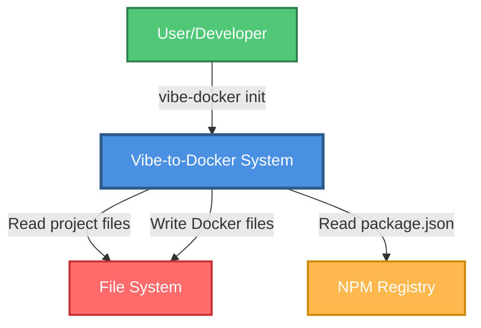
```mermaid
graph TB
    User[User/Developer]
    VTD[Vibe-to-Docker System]
    FS[File System]
    NPM[NPM Registry]

    User -->|"vibe-docker init"| VTD
    VTD -->|Read project files| FS
    VTD -->|Read package.json| NPM
    VTD -->|Write Docker files| FS

    style VTD fill:#4A90E2,stroke:#2E5C8A,stroke-width:3px,color:#fff
    style User fill:#50C878,stroke:#2E7D4E,stroke-width:2px,color:#fff
    style FS fill:#FF6B6B,stroke:#C53030,stroke-width:2px,color:#fff
    style NPM fill:#FFB84D,stroke:#CC8800,stroke-width:2px,color:#fff
```

### C4 Model: Container Diagram

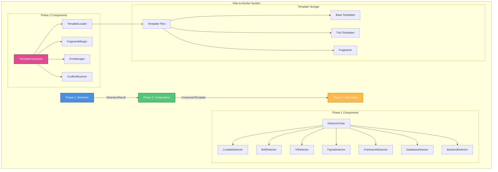
```mermaid
graph TB
    subgraph "Vibe-to-Docker System"
        P1[Phase 1: Detection]
        P2[Phase 2: Composition]
        P3[Phase 3: Generation]

        P1 -->|DetectionResult| P2
        P2 -->|ComposedTemplate| P3

        subgraph "Phase 1 Components"
            DC[DetectorChain]
            LD[LovableDetector]
            BD[BoltDetector]
            VD[V0Detector]
            FD[FigmaDetector]
            FRD[FrameworkDetector]
            DBD[DatabaseDetector]
            BED[BackendDetector]

            DC --> LD
            DC --> BD
            DC --> VD
            DC --> FD
            DC --> FRD
            DC --> DBD
            DC --> BED
        end

        subgraph "Phase 2 Components"
            TC[TemplateComposer]
            TL[TemplateLoader]
            FM[FragmentMerger]
            EM[EnvManager]
            CR[ConflictResolver]

            TC --> TL
            TC --> FM
            TC --> EM
            TC --> CR
        end

        subgraph "Template Storage"
            TS[Template Files]
            BT[Base Templates]
            TT[Tool Templates]
            FR[Fragments]

            TL --> TS
            TS --> BT
            TS --> TT
            TS --> FR
        end
    end

    style P1 fill:#4A90E2,stroke:#2E5C8A,stroke-width:2px,color:#fff
    style P2 fill:#50C878,stroke:#2E7D4E,stroke-width:2px,color:#fff
    style P3 fill:#FFB84D,stroke:#CC8800,stroke-width:2px,color:#fff
    style TC fill:#E24A90,stroke:#8A2E5C,stroke-width:2px,color:#fff
```

### 3-Layer Template Architecture

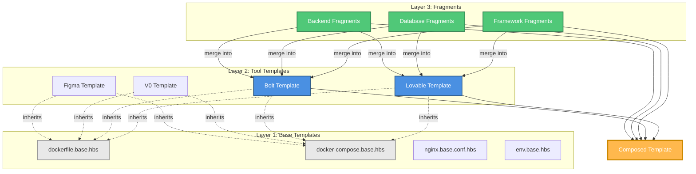
```mermaid
graph TD
    subgraph "Layer 1: Base Templates"
        B1[dockerfile.base.hbs]
        B2[docker-compose.base.hbs]
        B3[nginx.base.conf.hbs]
        B4[env.base.hbs]
    end

    subgraph "Layer 2: Tool Templates"
        T1[Lovable Template]
        T2[Bolt Template]
        T3[V0 Template]
        T4[Figma Template]

        T1 -.inherits.-> B1
        T1 -.inherits.-> B2
        T2 -.inherits.-> B1
        T2 -.inherits.-> B2
        T3 -.inherits.-> B1
        T3 -.inherits.-> B2
        T4 -.inherits.-> B1
        T4 -.inherits.-> B2
    end

    subgraph "Layer 3: Fragments"
        F1[Framework Fragments]
        F2[Database Fragments]
        F3[Backend Fragments]

        F1 -->|merge into| T1
        F1 -->|merge into| T2
        F2 -->|merge into| T1
        F2 -->|merge into| T2
        F3 -->|merge into| T1
        F3 -->|merge into| T2
    end

    CT[Composed Template]

    T1 --> CT
    T2 --> CT
    F1 --> CT
    F2 --> CT
    F3 --> CT

    style B1 fill:#E8E8E8,stroke:#999,stroke-width:2px
    style B2 fill:#E8E8E8,stroke:#999,stroke-width:2px
    style T1 fill:#4A90E2,stroke:#2E5C8A,stroke-width:2px,color:#fff
    style T2 fill:#4A90E2,stroke:#2E5C8A,stroke-width:2px,color:#fff
    style F1 fill:#50C878,stroke:#2E7D4E,stroke-width:2px,color:#fff
    style F2 fill:#50C878,stroke:#2E7D4E,stroke-width:2px,color:#fff
    style F3 fill:#50C878,stroke:#2E7D4E,stroke-width:2px,color:#fff
    style CT fill:#FFB84D,stroke:#CC8800,stroke-width:3px,color:#fff
```

---

## Component Diagrams

### TemplateComposer Component Architecture

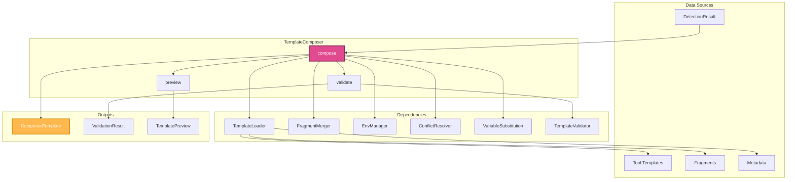
```mermaid
graph TB
    subgraph "TemplateComposer"
        TC[compose]
        TV[validate]
        TP[preview]

        TC --> TV
        TC --> TP
    end

    subgraph "Dependencies"
        TL[TemplateLoader]
        FM[FragmentMerger]
        EM[EnvManager]
        CR[ConflictResolver]
        VS[VariableSubstitution]
        VAL[TemplateValidator]
    end

    TC --> TL
    TC --> FM
    TC --> EM
    TC --> CR
    TC --> VS
    TV --> VAL

    subgraph "Data Sources"
        D1[DetectionResult]
        D2[Tool Templates]
        D3[Fragments]
        D4[Metadata]
    end

    D1 --> TC
    TL --> D2
    TL --> D3
    TL --> D4

    subgraph "Outputs"
        O1[ComposedTemplate]
        O2[ValidationResult]
        O3[TemplatePreview]
    end

    TC --> O1
    TV --> O2
    TP --> O3

    style TC fill:#E24A90,stroke:#8A2E5C,stroke-width:3px,color:#fff
    style O1 fill:#FFB84D,stroke:#CC8800,stroke-width:2px,color:#fff
```

### Fragment Merger Architecture

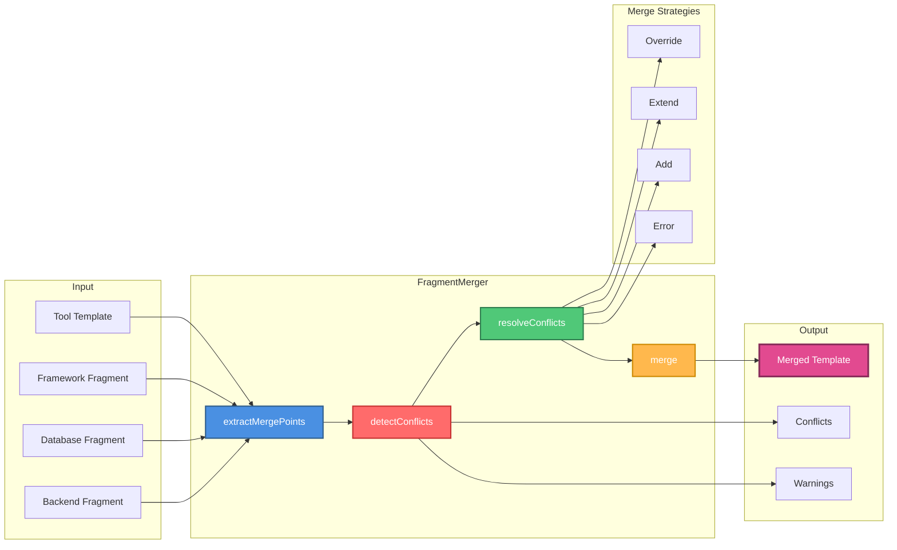
```mermaid
graph LR
    subgraph "Input"
        TT[Tool Template]
        F1[Framework Fragment]
        F2[Database Fragment]
        F3[Backend Fragment]
    end

    subgraph "FragmentMerger"
        EM[extractMergePoints]
        DC[detectConflicts]
        RC[resolveConflicts]
        M[merge]

        EM --> DC
        DC --> RC
        RC --> M
    end

    subgraph "Merge Strategies"
        S1[Override]
        S2[Extend]
        S3[Add]
        S4[Error]

        RC --> S1
        RC --> S2
        RC --> S3
        RC --> S4
    end

    subgraph "Output"
        MT[Merged Template]
        CF[Conflicts]
        WN[Warnings]
    end

    TT --> EM
    F1 --> EM
    F2 --> EM
    F3 --> EM

    M --> MT
    DC --> CF
    DC --> WN

    style EM fill:#4A90E2,stroke:#2E5C8A,stroke-width:2px,color:#fff
    style DC fill:#FF6B6B,stroke:#C53030,stroke-width:2px,color:#fff
    style RC fill:#50C878,stroke:#2E7D4E,stroke-width:2px,color:#fff
    style M fill:#FFB84D,stroke:#CC8800,stroke-width:2px,color:#fff
    style MT fill:#E24A90,stroke:#8A2E5C,stroke-width:3px,color:#fff
```

---

## Data Flow Diagrams

### Complete Composition Flow

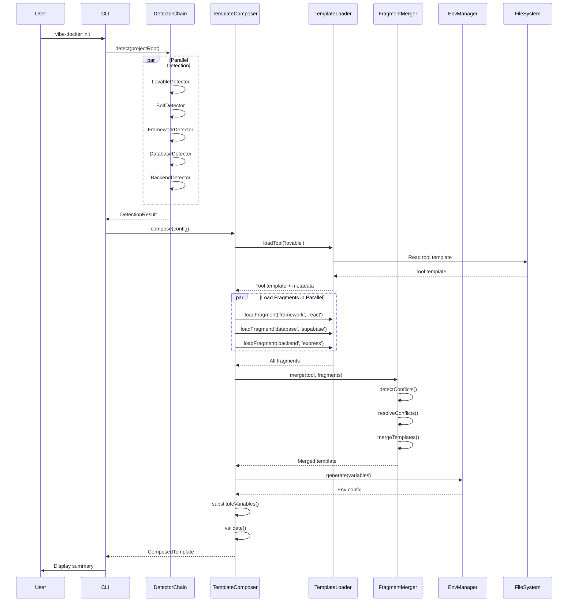
```mermaid
sequenceDiagram
    participant User
    participant CLI
    participant DetectorChain
    participant TemplateComposer
    participant TemplateLoader
    participant FragmentMerger
    participant EnvManager
    participant FileSystem

    User->>CLI: vibe-docker init
    CLI->>DetectorChain: detect(projectRoot)

    par Parallel Detection
        DetectorChain->>DetectorChain: LovableDetector
        DetectorChain->>DetectorChain: BoltDetector
        DetectorChain->>DetectorChain: FrameworkDetector
        DetectorChain->>DetectorChain: DatabaseDetector
        DetectorChain->>DetectorChain: BackendDetector
    end

    DetectorChain-->>CLI: DetectionResult

    CLI->>TemplateComposer: compose(config)

    TemplateComposer->>TemplateLoader: loadTool('lovable')
    TemplateLoader->>FileSystem: Read tool template
    FileSystem-->>TemplateLoader: Tool template
    TemplateLoader-->>TemplateComposer: Tool template + metadata

    par Load Fragments in Parallel
        TemplateComposer->>TemplateLoader: loadFragment('framework', 'react')
        TemplateComposer->>TemplateLoader: loadFragment('database', 'supabase')
        TemplateComposer->>TemplateLoader: loadFragment('backend', 'express')
    end

    TemplateLoader-->>TemplateComposer: All fragments

    TemplateComposer->>FragmentMerger: merge(tool, fragments)

    FragmentMerger->>FragmentMerger: detectConflicts()
    FragmentMerger->>FragmentMerger: resolveConflicts()
    FragmentMerger->>FragmentMerger: mergeTemplates()

    FragmentMerger-->>TemplateComposer: Merged template

    TemplateComposer->>EnvManager: generate(variables)
    EnvManager-->>TemplateComposer: Env config

    TemplateComposer->>TemplateComposer: substituteVariables()
    TemplateComposer->>TemplateComposer: validate()

    TemplateComposer-->>CLI: ComposedTemplate

    CLI->>User: Display summary
```

### Conflict Resolution Flow

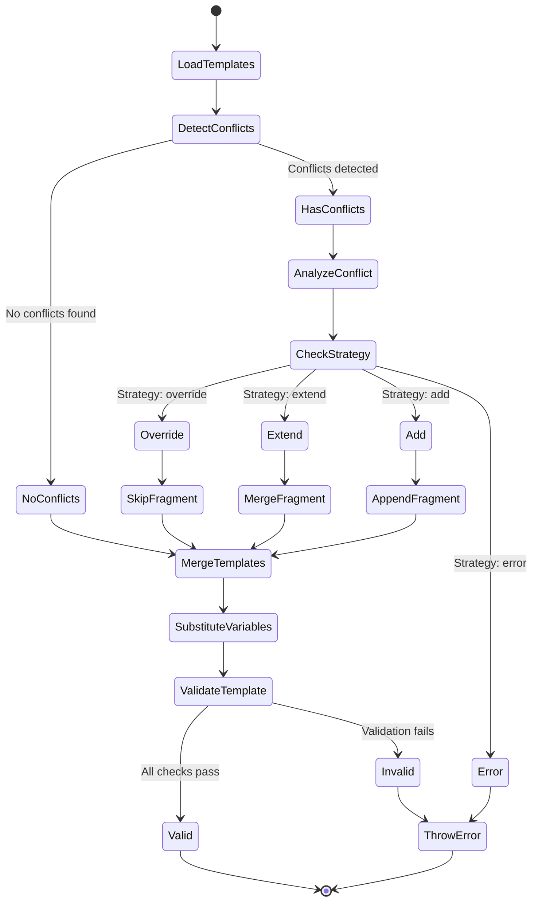
```mermaid
stateDiagram-v2
    [*] --> LoadTemplates
    LoadTemplates --> DetectConflicts

    DetectConflicts --> NoConflicts: No conflicts found
    DetectConflicts --> HasConflicts: Conflicts detected

    NoConflicts --> MergeTemplates

    HasConflicts --> AnalyzeConflict
    AnalyzeConflict --> CheckStrategy

    CheckStrategy --> Override: Strategy: override
    CheckStrategy --> Extend: Strategy: extend
    CheckStrategy --> Add: Strategy: add
    CheckStrategy --> Error: Strategy: error

    Override --> SkipFragment
    Extend --> MergeFragment
    Add --> AppendFragment
    Error --> ThrowError

    SkipFragment --> MergeTemplates
    MergeFragment --> MergeTemplates
    AppendFragment --> MergeTemplates
    ThrowError --> [*]

    MergeTemplates --> SubstituteVariables
    SubstituteVariables --> ValidateTemplate

    ValidateTemplate --> Valid: All checks pass
    ValidateTemplate --> Invalid: Validation fails

    Valid --> [*]
    Invalid --> ThrowError
```

### Variable Substitution Flow

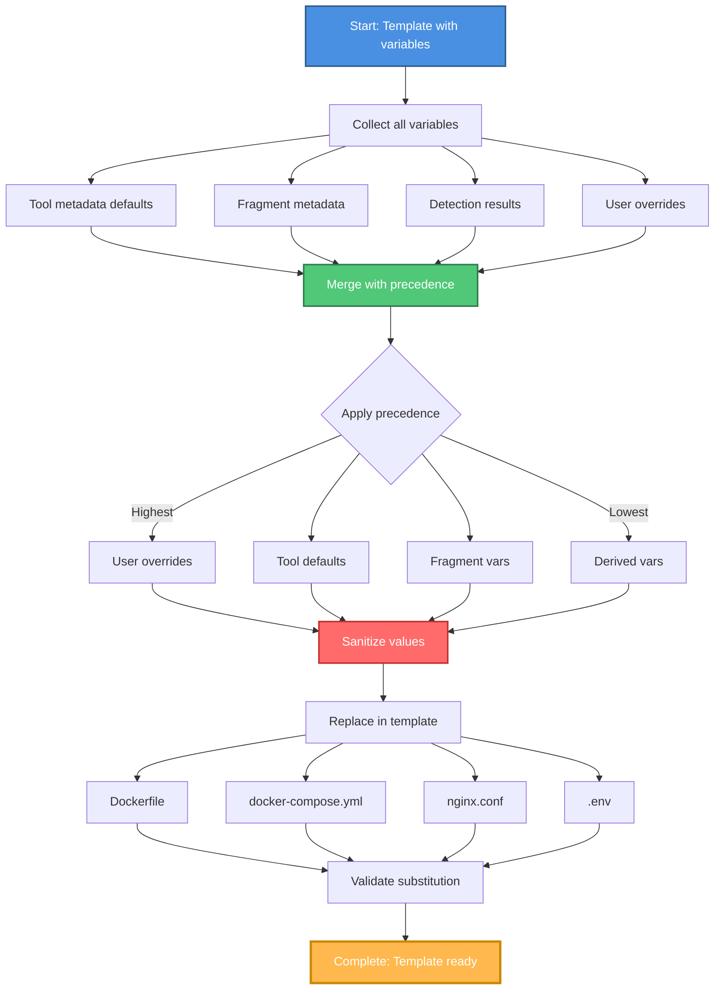
```mermaid
graph TD
    Start[Start: Template with variables] --> Collect[Collect all variables]

    Collect --> S1[Tool metadata defaults]
    Collect --> S2[Fragment metadata]
    Collect --> S3[Detection results]
    Collect --> S4[User overrides]

    S1 --> Merge[Merge with precedence]
    S2 --> Merge
    S3 --> Merge
    S4 --> Merge

    Merge --> Priority{Apply precedence}
    Priority -->|Highest| User[User overrides]
    Priority --> Tool[Tool defaults]
    Priority --> Fragment[Fragment vars]
    Priority -->|Lowest| Derived[Derived vars]

    User --> Sanitize[Sanitize values]
    Tool --> Sanitize
    Fragment --> Sanitize
    Derived --> Sanitize

    Sanitize --> Replace[Replace in template]

    Replace --> D1[Dockerfile]
    Replace --> D2[docker-compose.yml]
    Replace --> D3[nginx.conf]
    Replace --> D4[.env]

    D1 --> Validate[Validate substitution]
    D2 --> Validate
    D3 --> Validate
    D4 --> Validate

    Validate --> Complete[Complete: Template ready]

    style Start fill:#4A90E2,stroke:#2E5C8A,stroke-width:2px,color:#fff
    style Merge fill:#50C878,stroke:#2E7D4E,stroke-width:2px,color:#fff
    style Sanitize fill:#FF6B6B,stroke:#C53030,stroke-width:2px,color:#fff
    style Complete fill:#FFB84D,stroke:#CC8800,stroke-width:3px,color:#fff
```

---

## Class Diagrams

### Core Classes

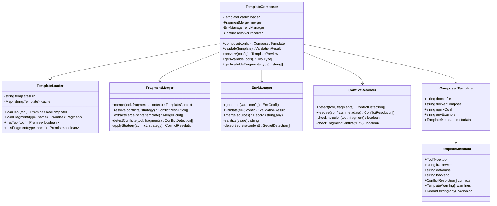
```mermaid
classDiagram
    class TemplateComposer {
        -TemplateLoader loader
        -FragmentMerger merger
        -EnvManager envManager
        -ConflictResolver resolver
        +compose(config) ComposedTemplate
        +validate(template) ValidationResult
        +preview(config) TemplatePreview
        +getAvailableTools() ToolType[]
        +getAvailableFragments(type) string[]
    }

    class TemplateLoader {
        -string templatesDir
        -Map~string,Template~ cache
        +loadTool(tool) Promise~ToolTemplate~
        +loadFragment(type, name) Promise~Fragment~
        +hasTool(tool) Promise~boolean~
        +hasFragment(type, name) Promise~boolean~
    }

    class FragmentMerger {
        +merge(tool, fragments, context) TemplateContent
        +resolve(conflicts, strategy) ConflictResolution[]
        +extractMergePoints(template) MergePoint[]
        -detectConflicts(tool, fragments) ConflictDetection[]
        -applyStrategy(conflict, strategy) ConflictResolution
    }

    class EnvManager {
        +generate(vars, config) EnvConfig
        +validate(env, config) ValidationResult
        +merge(sources) Record~string,any~
        -sanitize(value) string
        -detectSecrets(content) SecretDetection[]
    }

    class ConflictResolver {
        +detect(tool, fragments) ConflictDetection[]
        +resolve(conflicts, metadata) ConflictResolution[]
        -checkInclusion(tool, fragment) boolean
        -checkFragmentConflict(f1, f2) boolean
    }

    class ComposedTemplate {
        +string dockerfile
        +string dockerCompose
        +string nginxConf
        +string envExample
        +TemplateMetadata metadata
    }

    class TemplateMetadata {
        +ToolType tool
        +string framework
        +string database
        +string backend
        +ConflictResolution[] conflicts
        +TemplateWarning[] warnings
        +Record~string,any~ variables
    }

    TemplateComposer --> TemplateLoader
    TemplateComposer --> FragmentMerger
    TemplateComposer --> EnvManager
    TemplateComposer --> ConflictResolver
    TemplateComposer --> ComposedTemplate
    ComposedTemplate --> TemplateMetadata
```

### Template Hierarchy

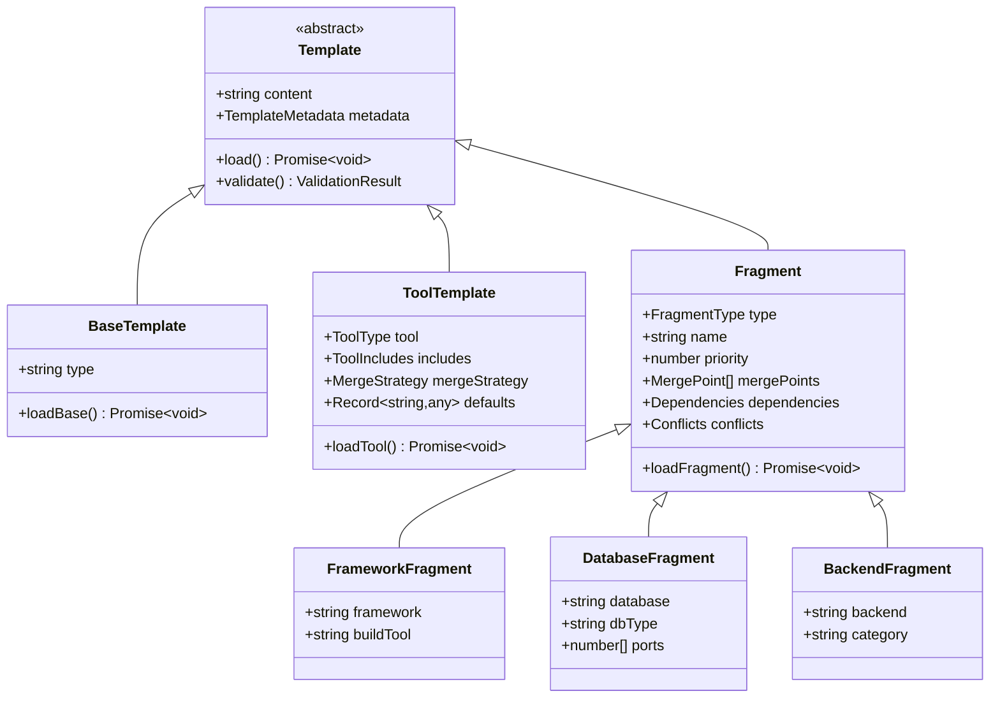
```mermaid
classDiagram
    class Template {
        <<abstract>>
        +string content
        +TemplateMetadata metadata
        +load() Promise~void~
        +validate() ValidationResult
    }

    class BaseTemplate {
        +string type
        +loadBase() Promise~void~
    }

    class ToolTemplate {
        +ToolType tool
        +ToolIncludes includes
        +MergeStrategy mergeStrategy
        +Record~string,any~ defaults
        +loadTool() Promise~void~
    }

    class Fragment {
        +FragmentType type
        +string name
        +number priority
        +MergePoint[] mergePoints
        +Dependencies dependencies
        +Conflicts conflicts
        +loadFragment() Promise~void~
    }

    class FrameworkFragment {
        +string framework
        +string buildTool
    }

    class DatabaseFragment {
        +string database
        +string dbType
        +number[] ports
    }

    class BackendFragment {
        +string backend
        +string category
    }

    Template <|-- BaseTemplate
    Template <|-- ToolTemplate
    Template <|-- Fragment
    Fragment <|-- FrameworkFragment
    Fragment <|-- DatabaseFragment
    Fragment <|-- BackendFragment
```

---

## Sequence Diagrams

### Lovable Project Composition

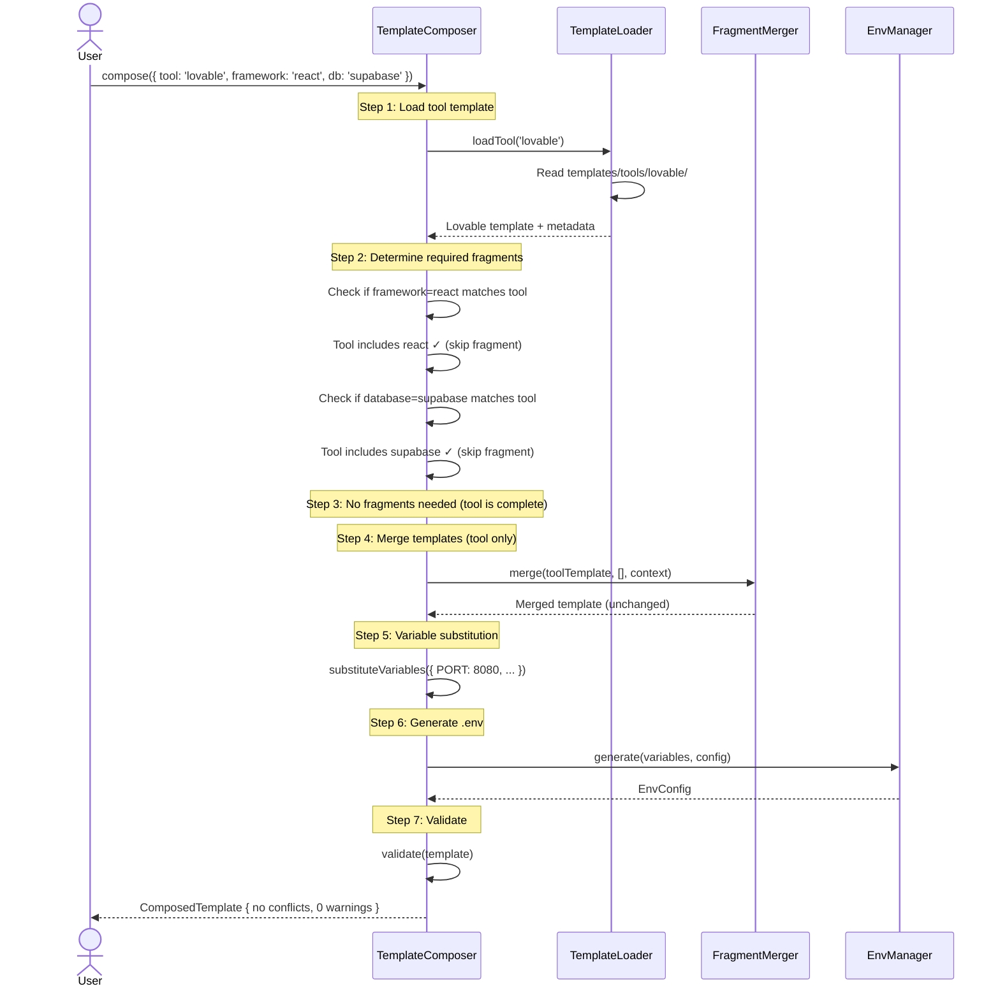
```mermaid
sequenceDiagram
    actor User
    participant Composer as TemplateComposer
    participant Loader as TemplateLoader
    participant Merger as FragmentMerger
    participant Env as EnvManager

    User->>Composer: compose({ tool: 'lovable', framework: 'react', db: 'supabase' })

    Note over Composer: Step 1: Load tool template
    Composer->>Loader: loadTool('lovable')
    Loader->>Loader: Read templates/tools/lovable/
    Loader-->>Composer: Lovable template + metadata

    Note over Composer: Step 2: Determine required fragments
    Composer->>Composer: Check if framework=react matches tool
    Composer->>Composer: Tool includes react ✓ (skip fragment)
    Composer->>Composer: Check if database=supabase matches tool
    Composer->>Composer: Tool includes supabase ✓ (skip fragment)

    Note over Composer: Step 3: No fragments needed (tool is complete)

    Note over Composer: Step 4: Merge templates (tool only)
    Composer->>Merger: merge(toolTemplate, [], context)
    Merger-->>Composer: Merged template (unchanged)

    Note over Composer: Step 5: Variable substitution
    Composer->>Composer: substituteVariables({ PORT: 8080, ... })

    Note over Composer: Step 6: Generate .env
    Composer->>Env: generate(variables, config)
    Env-->>Composer: EnvConfig

    Note over Composer: Step 7: Validate
    Composer->>Composer: validate(template)

    Composer-->>User: ComposedTemplate { no conflicts, 0 warnings }
```

### Complex Fullstack Composition with Conflicts

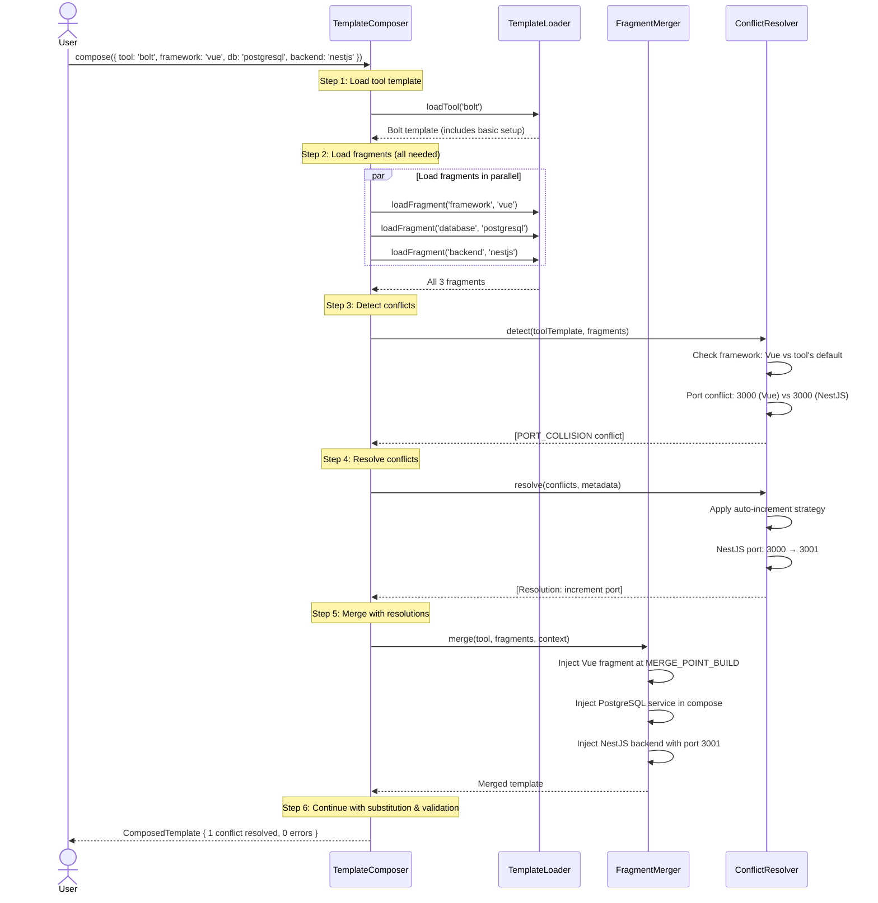
```mermaid
sequenceDiagram
    actor User
    participant Composer as TemplateComposer
    participant Loader as TemplateLoader
    participant Merger as FragmentMerger
    participant Resolver as ConflictResolver

    User->>Composer: compose({ tool: 'bolt', framework: 'vue', db: 'postgresql', backend: 'nestjs' })

    Note over Composer: Step 1: Load tool template
    Composer->>Loader: loadTool('bolt')
    Loader-->>Composer: Bolt template (includes basic setup)

    Note over Composer: Step 2: Load fragments (all needed)
    par Load fragments in parallel
        Composer->>Loader: loadFragment('framework', 'vue')
        Composer->>Loader: loadFragment('database', 'postgresql')
        Composer->>Loader: loadFragment('backend', 'nestjs')
    end
    Loader-->>Composer: All 3 fragments

    Note over Composer: Step 3: Detect conflicts
    Composer->>Resolver: detect(toolTemplate, fragments)
    Resolver->>Resolver: Check framework: Vue vs tool's default
    Resolver->>Resolver: Port conflict: 3000 (Vue) vs 3000 (NestJS)
    Resolver-->>Composer: [PORT_COLLISION conflict]

    Note over Composer: Step 4: Resolve conflicts
    Composer->>Resolver: resolve(conflicts, metadata)
    Resolver->>Resolver: Apply auto-increment strategy
    Resolver->>Resolver: NestJS port: 3000 → 3001
    Resolver-->>Composer: [Resolution: increment port]

    Note over Composer: Step 5: Merge with resolutions
    Composer->>Merger: merge(tool, fragments, context)
    Merger->>Merger: Inject Vue fragment at MERGE_POINT_BUILD
    Merger->>Merger: Inject PostgreSQL service in compose
    Merger->>Merger: Inject NestJS backend with port 3001
    Merger-->>Composer: Merged template

    Note over Composer: Step 6: Continue with substitution & validation
    Composer-->>User: ComposedTemplate { 1 conflict resolved, 0 errors }
```

### Cache Integration

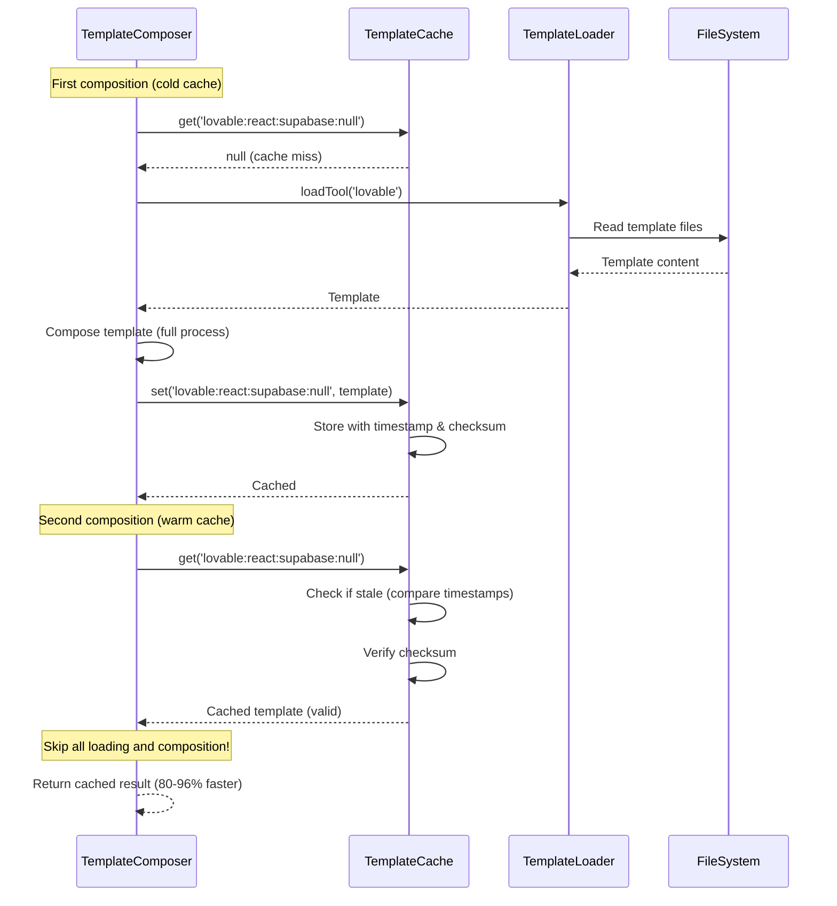
```mermaid
sequenceDiagram
    participant Composer as TemplateComposer
    participant Cache as TemplateCache
    participant Loader as TemplateLoader
    participant FS as FileSystem

    Note over Composer: First composition (cold cache)
    Composer->>Cache: get('lovable:react:supabase:null')
    Cache-->>Composer: null (cache miss)

    Composer->>Loader: loadTool('lovable')
    Loader->>FS: Read template files
    FS-->>Loader: Template content
    Loader-->>Composer: Template

    Composer->>Composer: Compose template (full process)

    Composer->>Cache: set('lovable:react:supabase:null', template)
    Cache->>Cache: Store with timestamp & checksum
    Cache-->>Composer: Cached

    Note over Composer: Second composition (warm cache)
    Composer->>Cache: get('lovable:react:supabase:null')
    Cache->>Cache: Check if stale (compare timestamps)
    Cache->>Cache: Verify checksum
    Cache-->>Composer: Cached template (valid)

    Note over Composer: Skip all loading and composition!

    Composer-->>Composer: Return cached result (80-96% faster)
```

---

## File Organization Diagram

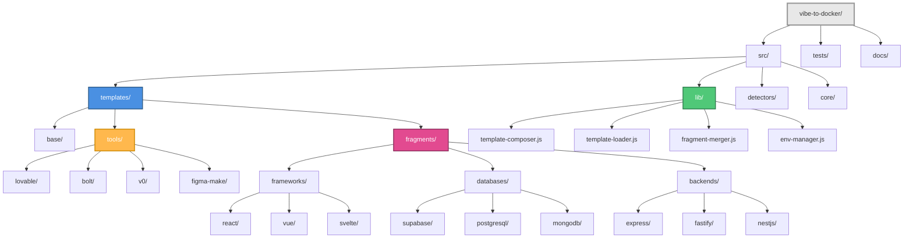
```mermaid
graph TD
    ROOT[vibe-to-docker/]

    ROOT --> SRC[src/]
    ROOT --> TESTS[tests/]
    ROOT --> DOCS[docs/]

    SRC --> TEMPLATES[templates/]
    SRC --> LIB[lib/]
    SRC --> DETECTORS[detectors/]
    SRC --> CORE[core/]

    TEMPLATES --> BASE[base/]
    TEMPLATES --> TOOLS[tools/]
    TEMPLATES --> FRAGMENTS[fragments/]

    TOOLS --> LOVABLE[lovable/]
    TOOLS --> BOLT[bolt/]
    TOOLS --> V0[v0/]
    TOOLS --> FIGMA[figma-make/]

    FRAGMENTS --> FRAMEWORKS[frameworks/]
    FRAGMENTS --> DATABASES[databases/]
    FRAGMENTS --> BACKENDS[backends/]

    FRAMEWORKS --> REACT[react/]
    FRAMEWORKS --> VUE[vue/]
    FRAMEWORKS --> SVELTE[svelte/]

    DATABASES --> SUPABASE[supabase/]
    DATABASES --> POSTGRES[postgresql/]
    DATABASES --> MONGO[mongodb/]

    BACKENDS --> EXPRESS[express/]
    BACKENDS --> FASTIFY[fastify/]
    BACKENDS --> NESTJS[nestjs/]

    LIB --> TC[template-composer.js]
    LIB --> TL[template-loader.js]
    LIB --> FM[fragment-merger.js]
    LIB --> EM[env-manager.js]

    style ROOT fill:#E8E8E8,stroke:#999,stroke-width:3px
    style TEMPLATES fill:#4A90E2,stroke:#2E5C8A,stroke-width:2px,color:#fff
    style LIB fill:#50C878,stroke:#2E7D4E,stroke-width:2px,color:#fff
    style TOOLS fill:#FFB84D,stroke:#CC8800,stroke-width:2px,color:#fff
    style FRAGMENTS fill:#E24A90,stroke:#8A2E5C,stroke-width:2px,color:#fff
```

---

## Performance Architecture

### Optimization Strategy

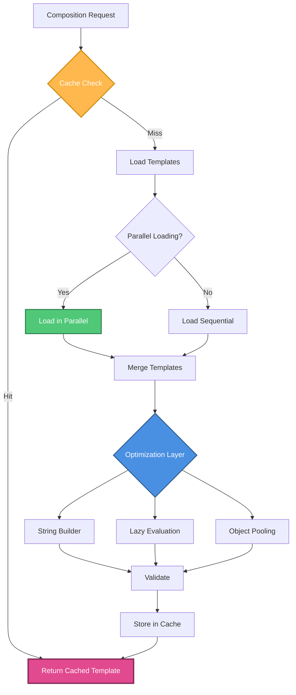
```mermaid
graph TD
    REQ[Composition Request]

    REQ --> CACHE{Cache Check}
    CACHE -->|Hit| RETURN[Return Cached Template]
    CACHE -->|Miss| LOAD[Load Templates]

    LOAD --> PARALLEL{Parallel Loading?}
    PARALLEL -->|Yes| PAR[Load in Parallel]
    PARALLEL -->|No| SEQ[Load Sequential]

    PAR --> MERGE[Merge Templates]
    SEQ --> MERGE

    MERGE --> OPT{Optimization Layer}
    OPT --> BUILDER[String Builder]
    OPT --> LAZY[Lazy Evaluation]
    OPT --> POOL[Object Pooling]

    BUILDER --> VALIDATE[Validate]
    LAZY --> VALIDATE
    POOL --> VALIDATE

    VALIDATE --> STORE[Store in Cache]
    STORE --> RETURN

    style CACHE fill:#FFB84D,stroke:#CC8800,stroke-width:2px,color:#fff
    style PAR fill:#50C878,stroke:#2E7D4E,stroke-width:2px,color:#fff
    style OPT fill:#4A90E2,stroke:#2E5C8A,stroke-width:2px,color:#fff
    style RETURN fill:#E24A90,stroke:#8A2E5C,stroke-width:3px,color:#fff
```

### Performance Metrics Dashboard

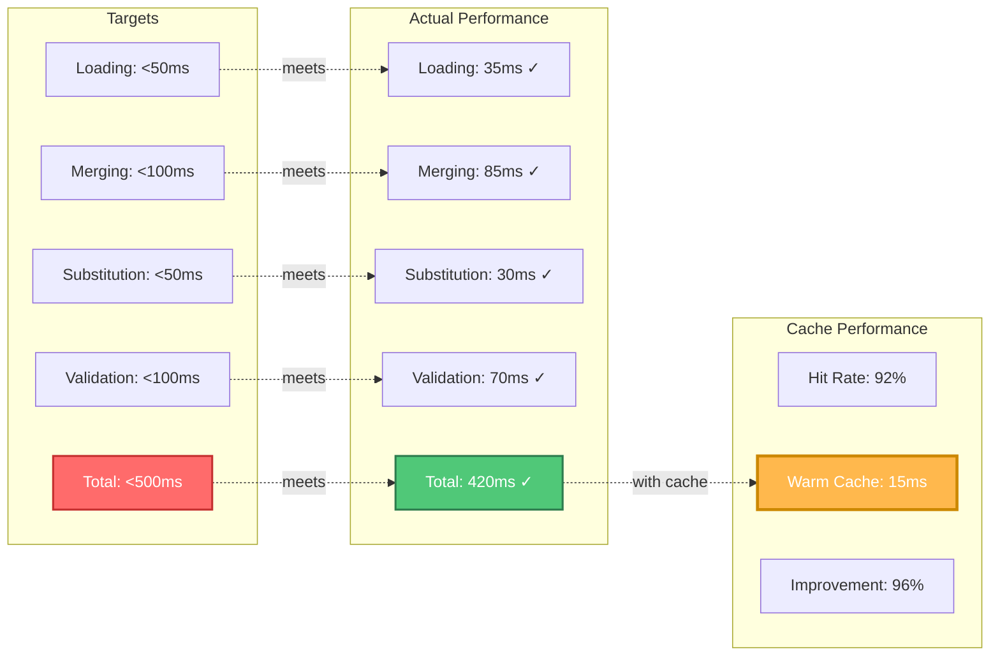
```mermaid
graph LR
    subgraph "Targets"
        T1[Loading: <50ms]
        T2[Merging: <100ms]
        T3[Substitution: <50ms]
        T4[Validation: <100ms]
        T5[Total: <500ms]
    end

    subgraph "Actual Performance"
        A1[Loading: 35ms ✓]
        A2[Merging: 85ms ✓]
        A3[Substitution: 30ms ✓]
        A4[Validation: 70ms ✓]
        A5[Total: 420ms ✓]
    end

    subgraph "Cache Performance"
        C1[Hit Rate: 92%]
        C2[Warm Cache: 15ms]
        C3[Improvement: 96%]
    end

    T1 -.meets.-> A1
    T2 -.meets.-> A2
    T3 -.meets.-> A3
    T4 -.meets.-> A4
    T5 -.meets.-> A5

    A5 -.with cache.-> C2

    style T5 fill:#FF6B6B,stroke:#C53030,stroke-width:2px,color:#fff
    style A5 fill:#50C878,stroke:#2E7D4E,stroke-width:2px,color:#fff
    style C2 fill:#FFB84D,stroke:#CC8800,stroke-width:3px,color:#fff
```

---

## Error Handling Architecture

### Error Flow Diagram

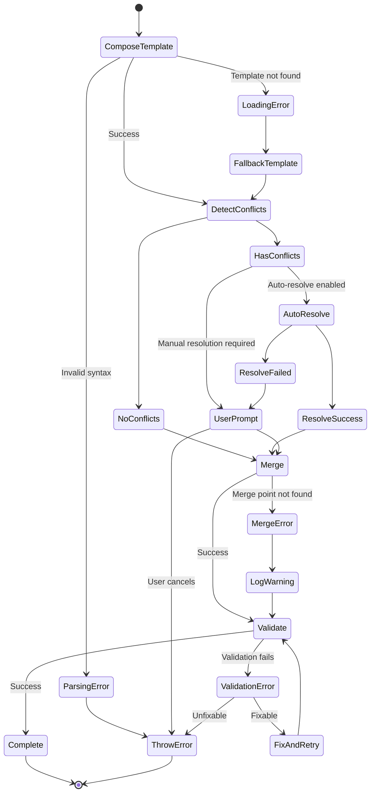
```mermaid
stateDiagram-v2
    [*] --> ComposeTemplate

    ComposeTemplate --> LoadingError: Template not found
    ComposeTemplate --> ParsingError: Invalid syntax
    ComposeTemplate --> DetectConflicts: Success

    LoadingError --> FallbackTemplate
    ParsingError --> ThrowError

    FallbackTemplate --> DetectConflicts

    DetectConflicts --> NoConflicts
    DetectConflicts --> HasConflicts

    NoConflicts --> Merge

    HasConflicts --> AutoResolve: Auto-resolve enabled
    HasConflicts --> UserPrompt: Manual resolution required

    AutoResolve --> ResolveSuccess
    AutoResolve --> ResolveFailed

    ResolveSuccess --> Merge
    ResolveFailed --> UserPrompt

    UserPrompt --> Merge
    UserPrompt --> ThrowError: User cancels

    Merge --> MergeError: Merge point not found
    Merge --> Validate: Success

    MergeError --> LogWarning
    LogWarning --> Validate

    Validate --> ValidationError: Validation fails
    Validate --> Complete: Success

    ValidationError --> FixAndRetry: Fixable
    ValidationError --> ThrowError: Unfixable

    FixAndRetry --> Validate

    Complete --> [*]
    ThrowError --> [*]
```

### Error Recovery Decision Tree

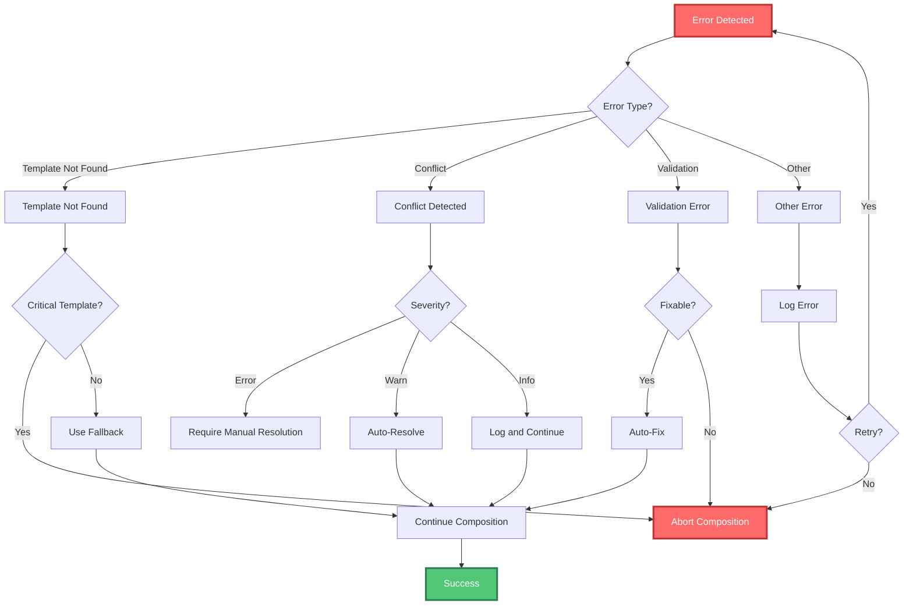
```mermaid
graph TD
    ERROR[Error Detected]

    ERROR --> TYPE{Error Type?}

    TYPE -->|Template Not Found| TNF[Template Not Found]
    TYPE -->|Conflict| CONF[Conflict Detected]
    TYPE -->|Validation| VAL[Validation Error]
    TYPE -->|Other| OTHER[Other Error]

    TNF --> CRITICAL{Critical Template?}
    CRITICAL -->|Yes| ABORT[Abort Composition]
    CRITICAL -->|No| FALLBACK[Use Fallback]

    CONF --> SEVERITY{Severity?}
    SEVERITY -->|Error| MANUAL[Require Manual Resolution]
    SEVERITY -->|Warn| AUTO[Auto-Resolve]
    SEVERITY -->|Info| LOG[Log and Continue]

    VAL --> FIXABLE{Fixable?}
    FIXABLE -->|Yes| FIX[Auto-Fix]
    FIXABLE -->|No| ABORT

    OTHER --> LOG2[Log Error]
    LOG2 --> RETRY{Retry?}
    RETRY -->|Yes| ERROR
    RETRY -->|No| ABORT

    FALLBACK --> CONTINUE[Continue Composition]
    AUTO --> CONTINUE
    LOG --> CONTINUE
    FIX --> CONTINUE
    CONTINUE --> SUCCESS[Success]

    style ERROR fill:#FF6B6B,stroke:#C53030,stroke-width:3px,color:#fff
    style SUCCESS fill:#50C878,stroke:#2E7D4E,stroke-width:3px,color:#fff
    style ABORT fill:#FF6B6B,stroke:#C53030,stroke-width:3px,color:#fff
```

---

## Appendix: Legend

### Diagram Color Coding

- **Blue** (#4A90E2): Core components and primary operations
- **Green** (#50C878): Success states and optimizations
- **Orange** (#FFB84D): Outputs and results
- **Pink** (#E24A90): Special components and highlights
- **Red** (#FF6B6B): Errors and conflicts
- **Gray** (#E8E8E8): Base/foundation components

### Node Shapes

- **Rectangle**: Process or component
- **Diamond**: Decision point
- **Ellipse**: Start/end state
- **Cylinder**: Data storage
- **Actor**: User interaction

### Relationship Types

- **Solid arrow** (→): Direct dependency or flow
- **Dashed arrow** (⇢): Inheritance or optional
- **Dotted line** (··→): Weak relationship or reference

---

**Document Version**: 1.0.0
**Last Updated**: 2025-11-12
**Related**: [TEMPLATE_ARCHITECTURE.md](./TEMPLATE_ARCHITECTURE.md)
