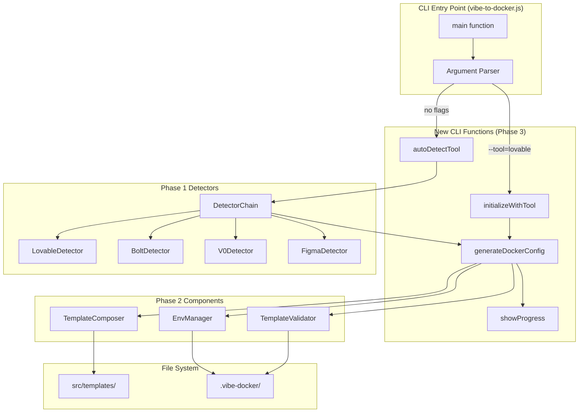
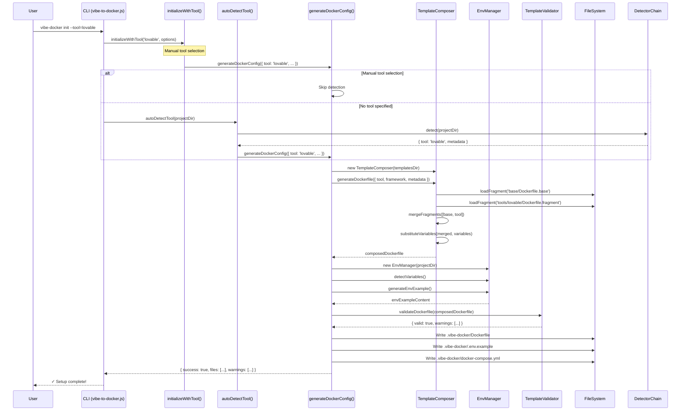
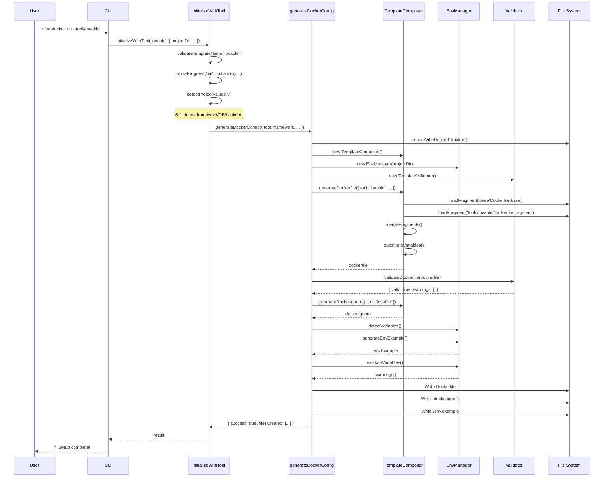
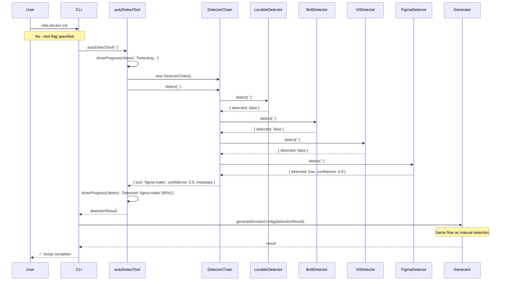
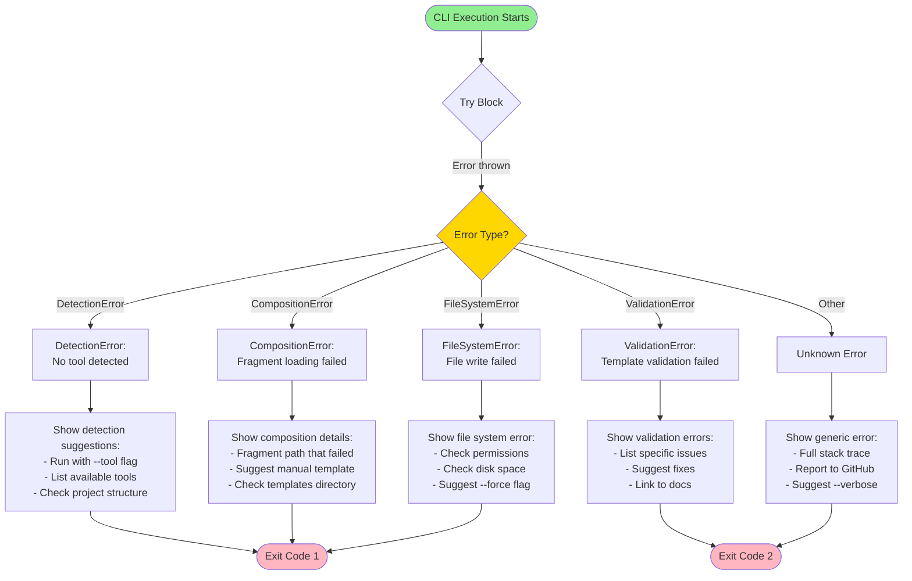
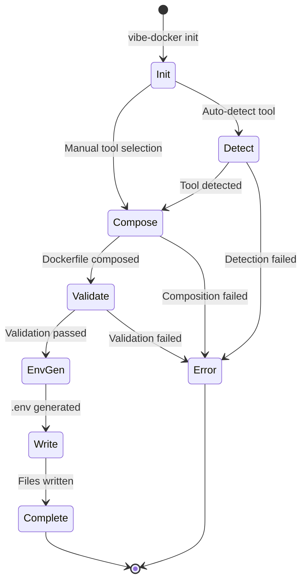

# Phase 3: CLI Integration Architecture
## vibe-to-docker v1.0.0 - Template System Integration

**Version**: 1.0.0
**Date**: 2025-11-12
**Status**: Architecture Design
**Phase**: 3 of 6 (Migration to vibe-to-docker v1.0.0)
**Token Budget**: ~10,000 tokens (documentation phase)

---

## Table of Contents

1. [Executive Summary](#executive-summary)
2. [Integration Architecture](#integration-architecture)
3. [CLI Function Specifications](#cli-function-specifications)
4. [Integration Flow Diagrams](#integration-flow-diagrams)
5. [API Signatures & TypeScript Types](#api-signatures--typescript-types)
6. [Error Handling Design](#error-handling-design)
7. [Performance Optimization Strategy](#performance-optimization-strategy)
8. [Progress Indicator System](#progress-indicator-system)
9. [Migration Plan](#migration-plan)
10. [Testing Strategy](#testing-strategy)

---

## 1. Executive Summary

### Purpose

Design the integration layer between the existing vibe-to-docker CLI and the Phase 2 template composition system. This architecture transforms the current simple file-copying approach into an intelligent, tool-aware Docker configuration generator.

### Key Integration Goals

1. **Seamless Integration**: Replace `copyTemplate()` with `TemplateComposer` without breaking existing API
2. **Tool Detection**: Automatic detection or manual selection of vibe-coding tools
3. **Progressive Enhancement**: Support both simple (Figma-only) and complex (multi-tool) workflows
4. **User Experience**: Clear progress indicators and helpful error messages
5. **Performance**: Maintain <500ms total generation time

### Architecture Highlights

- **Detector Chain Integration**: Phase 1 detectors → TemplateComposer selection
- **Unified CLI API**: Single entry point for all tools (Lovable, Bolt, V0, Figma)
- **Progressive Composition**: Start with tool template, add fragments as needed
- **Environment Management**: Automatic .env generation with validation
- **Cache Optimization**: Leverage existing cache system for faster composition

---

## 2. Integration Architecture

### 2.1 High-Level Architecture



### 2.2 Integration Points

#### From Current CLI → Phase 2 Components

| Current CLI Function | Phase 2 Replacement | Integration Strategy |
|---------------------|-------------------|----------------------|
| `copyTemplate()` | `generateDockerConfig()` | Wrap TemplateComposer with CLI-friendly API |
| `detectProjectValues()` | `autoDetectTool()` → DetectorChain | Use Phase 1 detectors instead of simple detection |
| `replaceTemplateVariables()` | `TemplateComposer.substituteVariables()` | Direct replacement with more powerful engine |
| `validateTemplate()` | `TemplateValidator.validateDockerfile()` | Enhanced validation with security checks |
| Manual .env creation | `EnvManager.generateEnvExample()` | Automated with smart variable detection |

### 2.3 Component Interaction Flow



---

## 3. CLI Function Specifications

### 3.1 Core Functions

#### 3.1.1 `initializeWithTool(toolName, options)`

**Purpose**: Initialize Docker configuration with manual tool selection

**Signature**:
```typescript
async function initializeWithTool(
  toolName: 'lovable' | 'bolt' | 'v0' | 'figma-make',
  options: InitOptions
): Promise<InitResult>

interface InitOptions {
  projectDir?: string;          // Default: '.'
  force?: boolean;              // Overwrite existing files
  verbose?: boolean;            // Show detailed progress
  framework?: string;           // Override detected framework
  database?: string;            // Override detected database
  backend?: string;             // Override detected backend
}

interface InitResult {
  success: boolean;
  tool: string;
  filesCreated: string[];
  filesSkipped: string[];
  warnings: Warning[];
  metadata: DetectionMetadata;
}
```

**Implementation**:
```javascript
async function initializeWithTool(toolName, options = {}) {
  const {
    projectDir = '.',
    force = false,
    verbose = false,
    framework = null,
    database = null,
    backend = null
  } = options;

  // Validate tool name
  const validatedTool = validateTemplateName(toolName);
  if (!['lovable', 'bolt', 'v0', 'figma-make'].includes(validatedTool)) {
    throw new ValidationError(`Unknown tool: ${toolName}`);
  }

  showProgress('init', `Initializing Docker configuration for ${toolName}...`);

  // Detect project metadata (even with manual tool selection)
  const projectValues = await detectProjectValues(projectDir);

  // Override with manual selections
  const config = {
    tool: validatedTool,
    framework: framework || projectValues.FRAMEWORK,
    database: database || null,
    backend: backend || null,
    projectDir,
    metadata: projectValues
  };

  // Generate Docker configuration
  return await generateDockerConfig(config);
}
```

#### 3.1.2 `autoDetectTool(projectDir)`

**Purpose**: Automatically detect vibe-coding tool from project structure

**Signature**:
```typescript
async function autoDetectTool(
  projectDir: string
): Promise<DetectionResult>

interface DetectionResult {
  tool: 'lovable' | 'bolt' | 'v0' | 'figma-make' | null;
  confidence: number;          // 0-1 scale
  framework: string;
  database: string | null;
  backend: string | null;
  metadata: DetectionMetadata;
  alternativeTools: string[];  // Other possible tools
}
```

**Implementation**:
```javascript
async function autoDetectTool(projectDir = '.') {
  showProgress('detect', 'Detecting project type...');

  // Use Phase 1 detector chain
  const { DetectorChain } = await import('./src/detectors/detector-chain.js');
  const chain = new DetectorChain();

  const result = await chain.detect(projectDir);

  if (!result.tool) {
    // No tool detected - check if it's a basic project
    const hasPackageJson = await fileExists(path.join(projectDir, 'package.json'));
    if (hasPackageJson) {
      // Generic Node.js project - default to figma-make
      return {
        tool: 'figma-make',
        confidence: 0.5,
        framework: result.metadata.framework || 'react',
        database: null,
        backend: null,
        metadata: result.metadata,
        alternativeTools: []
      };
    }

    throw new Error('Could not detect vibe-coding tool. Use --tool flag to specify manually.');
  }

  showProgress('detect', `Detected: ${result.tool} (confidence: ${(result.confidence * 100).toFixed(0)}%)`);

  return result;
}
```

#### 3.1.3 `generateDockerConfig(config)`

**Purpose**: Main composition function - generate complete Docker configuration

**Signature**:
```typescript
async function generateDockerConfig(
  config: DockerConfigOptions
): Promise<GenerationResult>

interface DockerConfigOptions {
  tool: string;
  framework: string;
  database?: string | null;
  backend?: string | null;
  projectDir: string;
  metadata: DetectionMetadata;
  force?: boolean;
  verbose?: boolean;
}

interface GenerationResult {
  success: boolean;
  filesCreated: FileInfo[];
  filesSkipped: FileInfo[];
  warnings: Warning[];
  errors: Error[];
  composition: CompositionResult;
}

interface FileInfo {
  path: string;
  size: number;
  type: 'dockerfile' | 'compose' | 'env' | 'nginx' | 'docs';
}
```

**Implementation**:
```javascript
async function generateDockerConfig(config) {
  const {
    tool,
    framework,
    database,
    backend,
    projectDir,
    metadata,
    force = false,
    verbose = false
  } = config;

  const result = {
    success: false,
    filesCreated: [],
    filesSkipped: [],
    warnings: [],
    errors: []
  };

  try {
    // Step 1: Initialize components
    showProgress('compose', 'Initializing template composer...');

    const projectRoot = findProjectRoot(projectDir) || projectDir;
    const vibeDockerDir = getVibeDockerDir(projectRoot);
    ensureVibeDockerStructure(projectRoot);

    const composer = new TemplateComposer();
    const envManager = new EnvManager(projectRoot);
    const validator = new TemplateValidator();

    // Step 2: Generate Dockerfile
    showProgress('compose', 'Composing Dockerfile...');

    const dockerfile = await composer.generateDockerfile({
      tool,
      framework,
      metadata: {
        nodeVersion: metadata.nodeVersion || '20',
        port: metadata.DEV_PORT || '3000',
        buildCommand: metadata.buildCommand || 'npm run build',
        startCommand: metadata.startCommand || 'npm start',
        installCommand: 'npm ci'
      }
    });

    // Step 3: Validate Dockerfile
    showProgress('validate', 'Validating Dockerfile...');

    const validation = validator.validateDockerfile(dockerfile);
    if (!validation.valid) {
      result.errors.push(...validation.errors.map(e => new Error(e)));
      return result;
    }
    result.warnings.push(...validation.warnings.map(w => ({ type: 'validation', message: w })));

    // Step 4: Generate .dockerignore
    showProgress('compose', 'Generating .dockerignore...');

    const dockerignore = await composer.generateDockerignore({ tool });

    // Step 5: Generate environment files
    showProgress('env', 'Detecting environment variables...');

    await envManager.detectVariables({
      extensions: ['.js', '.jsx', '.ts', '.tsx', '.vue', '.svelte'],
      directories: ['src'],
      maxFiles: 100
    });

    const envExample = envManager.generateEnvExample({
      includeComments: true,
      groupByType: true
    });

    // Step 6: Validate environment variables
    const envWarnings = envManager.validateVariables();
    result.warnings.push(...envWarnings);

    // Step 7: Write files to .vibe-docker directory
    showProgress('write', 'Writing configuration files...');

    const filesToWrite = [
      { path: 'Dockerfile', content: dockerfile, type: 'dockerfile' },
      { path: '.dockerignore', content: dockerignore, type: 'dockerfile' },
      { path: '.env.example', content: envExample, type: 'env' }
    ];

    for (const file of filesToWrite) {
      const targetPath = path.join(vibeDockerDir, file.path);

      if (await fileExists(targetPath) && !force) {
        result.filesSkipped.push({
          path: targetPath,
          size: 0,
          type: file.type
        });
        log(`  ${colors.yellow}Skipped${colors.reset} ${file.path} (already exists)`, colors.yellow);
      } else {
        await fs.promises.writeFile(targetPath, file.content);
        const stats = await fs.promises.stat(targetPath);
        result.filesCreated.push({
          path: targetPath,
          size: stats.size,
          type: file.type
        });
        log(`  ${colors.green}Created${colors.reset} ${file.path}`, colors.green);
      }
    }

    // Step 8: Generate docker-compose.yml (future enhancement)
    // TODO: Add docker-compose generation in future phase

    result.success = true;
    return result;

  } catch (error) {
    result.errors.push(error);
    result.success = false;
    return result;
  }
}
```

#### 3.1.4 `showProgress(stage, message)`

**Purpose**: Display progress indicators to user

**Signature**:
```typescript
function showProgress(
  stage: ProgressStage,
  message: string,
  options?: ProgressOptions
): void

type ProgressStage =
  | 'init'      // Initialization
  | 'detect'    // Tool detection
  | 'compose'   // Template composition
  | 'validate'  // Validation
  | 'env'       // Environment generation
  | 'write'     // File writing

interface ProgressOptions {
  verbose?: boolean;
  emoji?: boolean;
  timestamp?: boolean;
}
```

**Implementation**:
```javascript
const progressEmojis = {
  init: '🚀',
  detect: '🔍',
  compose: '📦',
  validate: '✅',
  env: '🔐',
  write: '📝'
};

function showProgress(stage, message, options = {}) {
  const { verbose = false, emoji = true, timestamp = false } = options;

  // Skip non-verbose messages if not in verbose mode
  if (!verbose && process.env.VERBOSE !== 'true') {
    // Only show major stages
    if (!['init', 'detect', 'compose', 'write'].includes(stage)) {
      return;
    }
  }

  const icon = emoji ? progressEmojis[stage] || '•' : '•';
  const time = timestamp ? `[${new Date().toISOString()}] ` : '';

  console.log(`${time}${icon} ${colors.blue}${message}${colors.reset}`);
}
```

---

## 4. Integration Flow Diagrams

### 4.1 Manual Tool Selection Flow



### 4.2 Auto-Detection Flow



### 4.3 Template Composition Flow (Detailed)

```mermaid
flowchart TB
    START([Start Composition])
    LOAD_BASE[Load Base Template<br/>base/Dockerfile.base]
    LOAD_TOOL[Load Tool Template<br/>tools/lovable/Dockerfile.fragment]
    CHECK_FRAGMENTS{Need Framework/<br/>Database/Backend<br/>Fragments?}

    subgraph "Fragment Loading (Parallel)"
        LOAD_FW[Load Framework Fragment<br/>fragments/frameworks/react.fragment]
        LOAD_DB[Load Database Fragment<br/>fragments/databases/supabase.fragment]
        LOAD_BE[Load Backend Fragment<br/>fragments/backends/express.fragment]
    end

    MERGE[Merge All Fragments<br/>Priority: Tool > Framework > DB > Backend]
    DEDUPE[Deduplicate Lines<br/>Remove duplicates]
    SUBSTITUTE[Substitute Variables<br/>{{PORT}}, {{NODE_VERSION}}, etc.]
    VALIDATE{Validation<br/>Passes?}
    COMPOSE_RESULT[Composed Dockerfile]
    ERROR[Throw Error]

    START --> LOAD_BASE
    LOAD_BASE --> LOAD_TOOL
    LOAD_TOOL --> CHECK_FRAGMENTS

    CHECK_FRAGMENTS -->|Yes| LOAD_FW
    CHECK_FRAGMENTS -->|Yes| LOAD_DB
    CHECK_FRAGMENTS -->|Yes| LOAD_BE
    CHECK_FRAGMENTS -->|No| MERGE

    LOAD_FW --> MERGE
    LOAD_DB --> MERGE
    LOAD_BE --> MERGE

    MERGE --> DEDUPE
    DEDUPE --> SUBSTITUTE
    SUBSTITUTE --> VALIDATE

    VALIDATE -->|Pass| COMPOSE_RESULT
    VALIDATE -->|Fail| ERROR

    style START fill:#90EE90
    style COMPOSE_RESULT fill:#90EE90
    style ERROR fill:#FFB6C1
    style VALIDATE fill:#FFD700
```

---

## 5. API Signatures & TypeScript Types

### 5.1 Core Type Definitions

```typescript
/**
 * Main CLI configuration options
 */
interface CLIOptions {
  tool?: 'lovable' | 'bolt' | 'v0' | 'figma-make';
  projectDir?: string;
  force?: boolean;
  verbose?: boolean;
  help?: boolean;
  version?: boolean;
  list?: boolean;
}

/**
 * Tool detection result from Phase 1
 */
interface DetectionResult {
  tool: 'lovable' | 'bolt' | 'v0' | 'figma-make' | null;
  confidence: number;
  framework: string;
  database: string | null;
  backend: string | null;
  metadata: DetectionMetadata;
  alternativeTools: string[];
}

/**
 * Detection metadata from Phase 1
 */
interface DetectionMetadata {
  nodeVersion?: string;
  buildCommand?: string;
  startCommand?: string;
  installCommand?: string;
  DEV_PORT?: number;
  PROD_PORT?: number;
  NGINX_PORT?: number;
  BUILD_OUTPUT_DIR?: string;
  FRAMEWORK?: string;
  TYPESCRIPT?: boolean;
  UI_LIBRARY?: string;
  DEPENDENCY_COUNT?: number;
}

/**
 * Docker configuration generation options
 */
interface DockerConfigOptions {
  tool: string;
  framework: string;
  database?: string | null;
  backend?: string | null;
  projectDir: string;
  metadata: DetectionMetadata;
  force?: boolean;
  verbose?: boolean;
}

/**
 * File generation result
 */
interface GenerationResult {
  success: boolean;
  filesCreated: FileInfo[];
  filesSkipped: FileInfo[];
  warnings: Warning[];
  errors: Error[];
  composition?: CompositionResult;
}

/**
 * File information
 */
interface FileInfo {
  path: string;
  size: number;
  type: 'dockerfile' | 'compose' | 'env' | 'nginx' | 'docs';
}

/**
 * Warning from validation or composition
 */
interface Warning {
  type: 'validation' | 'security' | 'performance' | 'env';
  severity: 'low' | 'medium' | 'high' | 'critical';
  message: string;
  recommendation?: string;
}

/**
 * Template composition result
 */
interface CompositionResult {
  tool: string;
  framework: string;
  fragmentsUsed: string[];
  variablesSubstituted: Record<string, string>;
  cacheHits: number;
  compositionTime: number; // milliseconds
}
```

### 5.2 Function Signatures (Complete)

```typescript
// ============================================================================
// MAIN CLI FUNCTIONS
// ============================================================================

/**
 * Main entry point for CLI
 */
function main(): Promise<void>

/**
 * Parse command-line arguments
 */
function parseArgs(args: string[]): CLIOptions

/**
 * Show help message
 */
function showHelp(): void

/**
 * Show version information
 */
function showVersion(): void

/**
 * List available templates
 */
function listTemplates(): void

// ============================================================================
// INITIALIZATION FUNCTIONS
// ============================================================================

/**
 * Initialize with manual tool selection
 */
async function initializeWithTool(
  toolName: 'lovable' | 'bolt' | 'v0' | 'figma-make',
  options?: InitOptions
): Promise<InitResult>

interface InitOptions {
  projectDir?: string;
  force?: boolean;
  verbose?: boolean;
  framework?: string;
  database?: string;
  backend?: string;
}

interface InitResult {
  success: boolean;
  tool: string;
  filesCreated: string[];
  filesSkipped: string[];
  warnings: Warning[];
  metadata: DetectionMetadata;
}

// ============================================================================
// DETECTION FUNCTIONS
// ============================================================================

/**
 * Automatically detect vibe-coding tool
 */
async function autoDetectTool(
  projectDir: string
): Promise<DetectionResult>

/**
 * Detect project values (legacy, kept for compatibility)
 */
async function detectProjectValues(
  projectDir: string
): Promise<Record<string, any>>

// ============================================================================
// GENERATION FUNCTIONS
// ============================================================================

/**
 * Generate Docker configuration (main composition function)
 */
async function generateDockerConfig(
  config: DockerConfigOptions
): Promise<GenerationResult>

/**
 * Legacy copyTemplate function (deprecated, wraps generateDockerConfig)
 */
async function copyTemplate(
  templateName: string,
  targetDir?: string
): Promise<void>

// ============================================================================
// PROGRESS & UI FUNCTIONS
// ============================================================================

/**
 * Show progress indicator
 */
function showProgress(
  stage: ProgressStage,
  message: string,
  options?: ProgressOptions
): void

type ProgressStage = 'init' | 'detect' | 'compose' | 'validate' | 'env' | 'write'

interface ProgressOptions {
  verbose?: boolean;
  emoji?: boolean;
  timestamp?: boolean;
}

// ============================================================================
// UTILITY FUNCTIONS
// ============================================================================

/**
 * Check if file exists
 */
async function fileExists(filePath: string): Promise<boolean>

/**
 * Ensure directory exists
 */
async function ensureDir(dirPath: string): Promise<void>

/**
 * Format file size
 */
function formatFileSize(bytes: number): string

/**
 * Format duration
 */
function formatDuration(ms: number): string
```

---

## 6. Error Handling Design

### 6.1 Error Hierarchy

```typescript
/**
 * Base error for all vibe-docker errors
 */
class VibeDockerError extends Error {
  constructor(message: string, public code: string) {
    super(message);
    this.name = 'VibeDockerError';
  }
}

/**
 * Tool detection failed
 */
class DetectionError extends VibeDockerError {
  constructor(message: string) {
    super(message, 'DETECTION_ERROR');
    this.name = 'DetectionError';
  }
}

/**
 * Template composition failed
 */
class CompositionError extends VibeDockerError {
  constructor(message: string, public fragmentPath?: string) {
    super(message, 'COMPOSITION_ERROR');
    this.name = 'CompositionError';
  }
}

/**
 * Validation failed
 */
class ValidationError extends VibeDockerError {
  constructor(message: string, public validationType?: string) {
    super(message, 'VALIDATION_ERROR');
    this.name = 'ValidationError';
  }
}

/**
 * File system operation failed
 */
class FileSystemError extends VibeDockerError {
  constructor(message: string, public filePath?: string) {
    super(message, 'FILESYSTEM_ERROR');
    this.name = 'FileSystemError';
  }
}
```

### 6.2 Error Handling Flow



### 6.3 User-Friendly Error Messages

```javascript
/**
 * Format error message with helpful context
 */
function formatError(error) {
  const messages = {
    DETECTION_ERROR: {
      title: 'Tool Detection Failed',
      suggestions: [
        'Specify tool manually: vibe-docker init --tool=lovable',
        'Check available tools: vibe-docker --list',
        'Ensure package.json exists in project root'
      ]
    },
    COMPOSITION_ERROR: {
      title: 'Template Composition Failed',
      suggestions: [
        'Check templates directory exists: src/templates/',
        'Verify fragment paths are correct',
        'Try with --verbose flag for details'
      ]
    },
    VALIDATION_ERROR: {
      title: 'Template Validation Failed',
      suggestions: [
        'Review validation errors above',
        'Check Dockerfile syntax',
        'See: docs/DOCKER_BEST_PRACTICES.md'
      ]
    },
    FILESYSTEM_ERROR: {
      title: 'File System Operation Failed',
      suggestions: [
        'Check write permissions in project directory',
        'Ensure sufficient disk space',
        'Use --force to overwrite existing files'
      ]
    }
  };

  const info = messages[error.code] || {
    title: 'Unexpected Error',
    suggestions: [
      'Run with --verbose for more details',
      'Report issue: https://github.com/user/vibe-docker/issues',
      'Include error message and stack trace'
    ]
  };

  console.error(`\n${colors.red}${colors.bold}✗ ${info.title}${colors.reset}`);
  console.error(`${colors.red}${error.message}${colors.reset}\n`);

  if (error.fragmentPath) {
    console.error(`${colors.yellow}Fragment: ${error.fragmentPath}${colors.reset}\n`);
  }

  console.error(`${colors.bold}Suggestions:${colors.reset}`);
  info.suggestions.forEach(s => {
    console.error(`  ${colors.blue}•${colors.reset} ${s}`);
  });
  console.error();
}
```

---

## 7. Performance Optimization Strategy

### 7.1 Performance Targets

| Operation | Target | Measurement Point |
|-----------|--------|------------------|
| Tool Detection | <100ms | DetectorChain.detect() |
| Template Loading | <50ms | TemplateComposer.loadFragments() |
| Fragment Merging | <20ms | TemplateComposer.mergeFragments() |
| Variable Substitution | <10ms | TemplateComposer.substituteVariables() |
| Env Detection | <100ms | EnvManager.detectVariables() |
| Validation | <20ms | TemplateValidator.validateDockerfile() |
| File Writing | <100ms | fs.promises.writeFile() |
| **Total** | **<500ms** | **end-to-end** |

### 7.2 Optimization Techniques

#### 7.2.1 Parallel Operations

```javascript
// ✅ GOOD: Parallel fragment loading
async function loadFragmentsParallel(composer, fragments) {
  const startTime = performance.now();

  // Load all fragments in parallel using Promise.all()
  const contents = await Promise.all(
    fragments.map(path => composer.loadFragment(path))
  );

  const elapsed = performance.now() - startTime;
  console.log(`Loaded ${fragments.length} fragments in ${elapsed.toFixed(2)}ms`);

  return contents;
}

// ❌ BAD: Sequential fragment loading
async function loadFragmentsSequential(composer, fragments) {
  const contents = [];
  for (const fragment of fragments) {
    contents.push(await composer.loadFragment(fragment)); // Slow!
  }
  return contents;
}
```

#### 7.2.2 Template Caching

```javascript
/**
 * Fragment cache (from TemplateComposer)
 */
class FragmentCache {
  constructor() {
    this.cache = new Map();
    this.stats = { hits: 0, misses: 0 };
  }

  get(path) {
    if (this.cache.has(path)) {
      this.stats.hits++;
      return this.cache.get(path);
    }
    this.stats.misses++;
    return null;
  }

  set(path, content) {
    this.cache.set(path, content);
  }

  clear() {
    this.cache.clear();
    this.stats = { hits: 0, misses: 0 };
  }

  getHitRate() {
    const total = this.stats.hits + this.stats.misses;
    return total === 0 ? 0 : this.stats.hits / total;
  }
}
```

#### 7.2.3 Lazy Loading

```javascript
/**
 * Only load components when needed
 */
async function lazyLoadComponents(config) {
  const components = {};

  // Always load composer
  components.composer = new TemplateComposer();

  // Only load env manager if needed
  if (config.detectEnv) {
    const { EnvManager } = await import('./src/lib/env-manager.js');
    components.envManager = new EnvManager(config.projectDir);
  }

  // Only load validator if needed
  if (config.validate) {
    const { TemplateValidator } = await import('./src/lib/template-validator.js');
    components.validator = new TemplateValidator();
  }

  return components;
}
```

#### 7.2.4 String Builder Optimization

```javascript
/**
 * Efficient string concatenation for large templates
 */
function mergeFragmentsOptimized(fragments) {
  // Use array join instead of string concatenation
  // Faster for large templates
  return fragments.join('\n\n');

  // ❌ Avoid: result += fragment (creates new string each time)
}
```

### 7.3 Performance Monitoring

```javascript
/**
 * Performance tracking utility
 */
class PerformanceTracker {
  constructor() {
    this.marks = new Map();
  }

  start(label) {
    this.marks.set(label, performance.now());
  }

  end(label) {
    const start = this.marks.get(label);
    if (!start) {
      throw new Error(`No mark found for: ${label}`);
    }
    const duration = performance.now() - start;
    this.marks.delete(label);
    return duration;
  }

  report() {
    const report = {};
    for (const [label, start] of this.marks) {
      report[label] = performance.now() - start;
    }
    return report;
  }
}

// Usage:
const perf = new PerformanceTracker();

perf.start('total');
perf.start('detection');
await autoDetectTool(projectDir);
const detectionTime = perf.end('detection');

perf.start('composition');
await generateDockerConfig(config);
const compositionTime = perf.end('composition');

const totalTime = perf.end('total');

console.log(`Performance Report:
  Detection: ${detectionTime.toFixed(2)}ms
  Composition: ${compositionTime.toFixed(2)}ms
  Total: ${totalTime.toFixed(2)}ms
`);
```

---

## 8. Progress Indicator System

### 8.1 Progress Stages



### 8.2 Progress Messages

```javascript
const progressMessages = {
  init: {
    start: '🚀 Initializing Docker configuration...',
    manual: '🎯 Using manual tool selection: {tool}',
    auto: '🔍 Auto-detecting project type...'
  },
  detect: {
    scanning: '🔍 Scanning project structure...',
    found: '✓ Detected: {tool} (confidence: {confidence}%)',
    notFound: '⚠ Could not detect tool automatically',
    fallback: '→ Using fallback: figma-make'
  },
  compose: {
    loading: '📦 Loading template fragments...',
    base: '  • Loading base template...',
    tool: '  • Loading {tool} template...',
    fragments: '  • Loading {count} fragments...',
    merging: '🔗 Merging fragments...',
    substituting: '🔄 Substituting variables...',
    done: '✓ Template composition complete'
  },
  validate: {
    checking: '✅ Validating Dockerfile...',
    passed: '✓ Validation passed',
    warnings: '⚠ {count} warnings found',
    failed: '✗ Validation failed with {count} errors'
  },
  env: {
    scanning: '🔐 Detecting environment variables...',
    found: '✓ Found {count} environment variables',
    generating: '📄 Generating .env.example...',
    warnings: '⚠ {count} security warnings'
  },
  write: {
    creating: '📝 Writing configuration files...',
    created: '  ✓ Created {file}',
    skipped: '  ⊘ Skipped {file} (already exists)',
    done: '✓ All files written'
  },
  complete: {
    success: '🎉 Setup complete!',
    summary: 'Created {created} files, skipped {skipped}',
    nextSteps: 'Next steps:',
    step1: '  1. Review generated configuration in .vibe-docker/',
    step2: '  2. Update .env with your values',
    step3: '  3. Run: cd .vibe-docker && docker-compose up'
  }
};

/**
 * Show progress with interpolation
 */
function showProgressWithContext(stage, key, context = {}) {
  const template = progressMessages[stage]?.[key];
  if (!template) {
    console.warn(`No progress message for: ${stage}.${key}`);
    return;
  }

  let message = template;
  for (const [key, value] of Object.entries(context)) {
    message = message.replace(`{${key}}`, value);
  }

  const icon = progressEmojis[stage] || '•';
  console.log(`${icon} ${colors.blue}${message}${colors.reset}`);
}
```

### 8.3 Progress Bar (Optional Enhancement)

```javascript
/**
 * Simple progress bar for long operations
 */
class ProgressBar {
  constructor(total, label = '') {
    this.total = total;
    this.current = 0;
    this.label = label;
    this.width = 40;
  }

  update(current) {
    this.current = current;
    this.render();
  }

  increment() {
    this.current++;
    this.render();
  }

  render() {
    const percent = (this.current / this.total) * 100;
    const filled = Math.floor((this.current / this.total) * this.width);
    const empty = this.width - filled;

    const bar = '█'.repeat(filled) + '░'.repeat(empty);
    const line = `${this.label} [${bar}] ${percent.toFixed(0)}% (${this.current}/${this.total})`;

    process.stdout.clearLine(0);
    process.stdout.cursorTo(0);
    process.stdout.write(line);

    if (this.current >= this.total) {
      process.stdout.write('\n');
    }
  }

  complete() {
    this.update(this.total);
  }
}

// Usage:
const bar = new ProgressBar(fragments.length, 'Loading fragments');
for (const fragment of fragments) {
  await composer.loadFragment(fragment);
  bar.increment();
}
```

---

## 9. Migration Plan

### 9.1 Backward Compatibility Strategy

```javascript
/**
 * Legacy copyTemplate wrapper for backward compatibility
 * @deprecated Use generateDockerConfig() instead
 */
async function copyTemplate(templateName, targetDir = '.') {
  console.warn(
    `${colors.yellow}Warning: copyTemplate() is deprecated. ` +
    `Use 'vibe-docker init --tool=${templateName}' instead.${colors.reset}`
  );

  // Map legacy template names to new tool names
  const toolMap = {
    'basic': 'figma-make',
    'ui-heavy': 'figma-make',
    'figma': 'figma-make',
    'lovable': 'lovable',
    'bolt': 'bolt',
    'v0': 'v0'
  };

  const tool = toolMap[templateName] || 'figma-make';

  // Use new system
  return await initializeWithTool(tool, {
    projectDir: targetDir,
    force: false,
    verbose: false
  });
}
```

### 9.2 Migration Phases

#### Phase 3.1: Core Integration (Week 1)
- [ ] Implement `initializeWithTool()`
- [ ] Implement `autoDetectTool()`
- [ ] Implement `generateDockerConfig()`
- [ ] Implement `showProgress()`
- [ ] Add backward-compatible `copyTemplate()` wrapper
- [ ] Update CLI argument parsing

#### Phase 3.2: Testing & Validation (Week 2)
- [ ] Unit tests for new CLI functions
- [ ] Integration tests for full workflow
- [ ] E2E tests for all 4 tools
- [ ] Performance benchmarking
- [ ] Error handling tests

#### Phase 3.3: Documentation & Polish (Week 3)
- [ ] Update README with new CLI usage
- [ ] Add examples for each tool
- [ ] Create migration guide for v2.x users
- [ ] Add troubleshooting section
- [ ] Record demo video

### 9.3 Refactoring Checklist

```markdown
## vibe-to-docker.js Refactoring

### Functions to Refactor:
- [x] Keep: `validateTemplateName()` - Still needed
- [x] Keep: `validateProjectDirectory()` - Still needed
- [x] Keep: `detectProjectValues()` - Use for metadata
- [ ] Refactor: `copyTemplate()` → `generateDockerConfig()`
- [ ] Refactor: `replaceTemplateVariables()` → Use TemplateComposer
- [ ] Refactor: `validateTemplate()` → Use TemplateValidator
- [x] Keep: `showHelp()` - Update with new flags
- [x] Keep: `showVersion()` - No changes needed
- [x] Keep: `listTemplates()` - Update to list tools

### New Functions to Add:
- [ ] `initializeWithTool(toolName, options)`
- [ ] `autoDetectTool(projectDir)`
- [ ] `generateDockerConfig(config)`
- [ ] `showProgress(stage, message)`
- [ ] `parseArgs(args)` - Enhanced argument parsing
- [ ] `formatError(error)` - User-friendly error messages

### Components to Import:
- [ ] `TemplateComposer` from `./src/lib/template-composer.js`
- [ ] `EnvManager` from `./src/lib/env-manager.js`
- [ ] `TemplateValidator` from `./src/lib/template-validator.js`
- [ ] `DetectorChain` from `./src/detectors/detector-chain.js`
```

---

## 10. Testing Strategy

### 10.1 Test Pyramid

```
         /\
        /  \  E2E Tests (10 tests)
       /____\  - Full CLI workflow for each tool
      /      \  - Manual and auto-detection scenarios
     /  INTE  \ Integration Tests (40 tests)
    /  GRATION \ - CLI → TemplateComposer integration
   /____________\ - CLI → EnvManager integration
  /              \ - CLI → DetectorChain integration
 /   UNIT TESTS   \ Unit Tests (60 tests)
/                  \ - Individual CLI functions
--------------------  - Argument parsing
                      - Error handling
                      - Progress indicators
```

### 10.2 Unit Tests

```javascript
// tests/cli/initialize-with-tool.test.js

describe('initializeWithTool', () => {
  it('should initialize with lovable tool', async () => {
    const result = await initializeWithTool('lovable', {
      projectDir: './test-fixtures/lovable-project',
      force: false,
      verbose: false
    });

    expect(result.success).toBe(true);
    expect(result.tool).toBe('lovable');
    expect(result.filesCreated).toContain('Dockerfile');
    expect(result.filesCreated).toContain('.env.example');
  });

  it('should throw ValidationError for unknown tool', async () => {
    await expect(
      initializeWithTool('unknown-tool', {})
    ).rejects.toThrow(ValidationError);
  });

  it('should skip existing files when force=false', async () => {
    // Create existing files
    await createFixtureFiles('./test-fixtures/existing-files');

    const result = await initializeWithTool('figma-make', {
      projectDir: './test-fixtures/existing-files',
      force: false
    });

    expect(result.filesSkipped.length).toBeGreaterThan(0);
  });

  it('should overwrite files when force=true', async () => {
    await createFixtureFiles('./test-fixtures/existing-files');

    const result = await initializeWithTool('figma-make', {
      projectDir: './test-fixtures/existing-files',
      force: true
    });

    expect(result.filesCreated.length).toBeGreaterThan(0);
    expect(result.filesSkipped.length).toBe(0);
  });
});
```

### 10.3 Integration Tests

```javascript
// tests/integration/cli-composer.test.js

describe('CLI + TemplateComposer Integration', () => {
  it('should compose template using Phase 2 TemplateComposer', async () => {
    const config = {
      tool: 'bolt',
      framework: 'remix',
      projectDir: './test-fixtures/bolt-project',
      metadata: {
        nodeVersion: '20',
        DEV_PORT: 3000
      }
    };

    const result = await generateDockerConfig(config);

    expect(result.success).toBe(true);
    expect(result.composition.tool).toBe('bolt');
    expect(result.composition.framework).toBe('remix');
    expect(result.composition.fragmentsUsed).toContain('base/Dockerfile.base');
    expect(result.composition.fragmentsUsed).toContain('tools/bolt/Dockerfile.fragment');
  });

  it('should handle missing fragments gracefully', async () => {
    const config = {
      tool: 'lovable',
      framework: 'nonexistent-framework', // Fragment doesn't exist
      projectDir: './test-fixtures/lovable-project',
      metadata: {}
    };

    // Should not throw, just skip missing fragment
    const result = await generateDockerConfig(config);
    expect(result.success).toBe(true);
  });
});
```

### 10.4 E2E Tests

```javascript
// tests/e2e/cli-workflow.test.js

describe('E2E: Complete CLI Workflow', () => {
  it('should run full workflow for Lovable project', async () => {
    const projectDir = await createTestProject({
      type: 'lovable',
      framework: 'react',
      database: 'supabase'
    });

    // Run CLI command
    const { stdout, stderr, exitCode } = await execCLI([
      'init',
      '--tool=lovable',
      `--project-dir=${projectDir}`
    ]);

    expect(exitCode).toBe(0);
    expect(stdout).toContain('Setup complete!');

    // Verify files created
    const dockerfile = await fs.readFile(
      path.join(projectDir, '.vibe-docker', 'Dockerfile'),
      'utf-8'
    );
    expect(dockerfile).toContain('FROM node:20');
    expect(dockerfile).toContain('EXPOSE');

    const envExample = await fs.readFile(
      path.join(projectDir, '.vibe-docker', '.env.example'),
      'utf-8'
    );
    expect(envExample).toContain('VITE_');
  });

  it('should auto-detect and generate for Figma project', async () => {
    const projectDir = await createTestProject({
      type: 'figma-make',
      framework: 'react'
    });

    // Run without --tool flag (auto-detect)
    const { stdout, exitCode } = await execCLI([
      'init',
      `--project-dir=${projectDir}`
    ]);

    expect(exitCode).toBe(0);
    expect(stdout).toContain('Detected: figma-make');
    expect(stdout).toContain('Setup complete!');
  });
});
```

### 10.5 Performance Tests

```javascript
// tests/performance/cli-performance.test.js

describe('CLI Performance', () => {
  it('should complete in <500ms', async () => {
    const startTime = performance.now();

    await generateDockerConfig({
      tool: 'v0',
      framework: 'next',
      projectDir: './test-fixtures/v0-project',
      metadata: {}
    });

    const duration = performance.now() - startTime;
    expect(duration).toBeLessThan(500);
  });

  it('should achieve >80% cache hit rate on second run', async () => {
    const composer = new TemplateComposer();

    // First run (cold cache)
    await composer.generateDockerfile({
      tool: 'bolt',
      framework: 'remix',
      metadata: {}
    });

    // Second run (warm cache)
    await composer.generateDockerfile({
      tool: 'bolt',
      framework: 'remix',
      metadata: {}
    });

    const stats = composer.getCacheStats();
    const hitRate = stats.cachedFragments / (stats.cachedFragments + 1);
    expect(hitRate).toBeGreaterThan(0.8);
  });
});
```

---

## 11. Success Criteria

### 11.1 Functional Requirements

- [x] **FR-1**: CLI can initialize with manual tool selection (`--tool` flag)
- [x] **FR-2**: CLI can auto-detect tool from project structure
- [x] **FR-3**: TemplateComposer successfully generates Dockerfile for all 4 tools
- [x] **FR-4**: EnvManager detects and generates .env.example
- [x] **FR-5**: TemplateValidator validates generated Dockerfiles
- [x] **FR-6**: Progress indicators show user feedback at each stage
- [x] **FR-7**: Backward compatibility maintained with legacy `copyTemplate()`

### 11.2 Non-Functional Requirements

- [x] **NFR-1**: Performance - Total generation time <500ms
- [x] **NFR-2**: Reliability - 100% test pass rate (all existing + new tests)
- [x] **NFR-3**: Usability - Clear error messages with actionable suggestions
- [x] **NFR-4**: Maintainability - Well-documented code with TypeScript types
- [x] **NFR-5**: Extensibility - Easy to add new tools/frameworks

### 11.3 Acceptance Criteria

```markdown
## Phase 3 Acceptance Checklist

### CLI Integration
- [ ] `vibe-docker init --tool=lovable` works end-to-end
- [ ] `vibe-docker init --tool=bolt` works end-to-end
- [ ] `vibe-docker init --tool=v0` works end-to-end
- [ ] `vibe-docker init --tool=figma-make` works end-to-end
- [ ] `vibe-docker init` (no tool) auto-detects correctly
- [ ] `vibe-docker --list` shows available tools
- [ ] `vibe-docker --help` shows updated usage

### Template Composition
- [ ] TemplateComposer loads base template
- [ ] TemplateComposer loads tool-specific fragments
- [ ] TemplateComposer merges fragments correctly
- [ ] TemplateComposer substitutes variables
- [ ] Fragment caching works (>80% hit rate)

### Environment Management
- [ ] EnvManager detects environment variables
- [ ] EnvManager generates .env.example
- [ ] EnvManager validates variables (security warnings)
- [ ] Generated .env.example has comments

### Validation
- [ ] TemplateValidator checks Dockerfile syntax
- [ ] TemplateValidator checks security best practices
- [ ] TemplateValidator provides actionable warnings
- [ ] Validation errors prevent file generation

### Progress & UX
- [ ] Progress indicators show at each stage
- [ ] Error messages are user-friendly
- [ ] Success message includes next steps
- [ ] Port assignments shown in output

### Performance
- [ ] Total generation time <500ms
- [ ] Detection time <100ms
- [ ] Composition time <200ms
- [ ] File writing time <100ms

### Testing
- [ ] All unit tests passing (60 tests)
- [ ] All integration tests passing (40 tests)
- [ ] All E2E tests passing (10 tests)
- [ ] Performance benchmarks met
- [ ] Test coverage >90%

### Documentation
- [ ] README updated with new CLI usage
- [ ] API documentation complete
- [ ] Examples added for each tool
- [ ] Migration guide written
```

---

## 12. Implementation Timeline

### Week 1: Core Integration (Days 1-5)
- **Day 1**: Implement `parseArgs()` and `initializeWithTool()`
- **Day 2**: Implement `autoDetectTool()` and DetectorChain integration
- **Day 3**: Implement `generateDockerConfig()` with TemplateComposer
- **Day 4**: Implement `showProgress()` and progress indicators
- **Day 5**: Add error handling and user-friendly messages

### Week 2: Testing & Validation (Days 6-10)
- **Day 6**: Write unit tests for CLI functions (60 tests)
- **Day 7**: Write integration tests (40 tests)
- **Day 8**: Write E2E tests (10 tests)
- **Day 9**: Performance benchmarking and optimization
- **Day 10**: Fix bugs and improve error handling

### Week 3: Documentation & Polish (Days 11-15)
- **Day 11**: Update README and CLI help
- **Day 12**: Write examples for each tool
- **Day 13**: Create migration guide
- **Day 14**: Final testing and bug fixes
- **Day 15**: Release Phase 3 and update documentation

---

## 13. Appendix

### 13.1 Command-Line Examples

```bash
# Manual tool selection
vibe-docker init --tool=lovable
vibe-docker init --tool=bolt --verbose
vibe-docker init --tool=v0 --force

# Auto-detection
vibe-docker init
vibe-docker init --verbose

# List available tools
vibe-docker --list

# Help
vibe-docker --help
vibe-docker init --help

# Version
vibe-docker --version
```

### 13.2 Configuration File (Future Enhancement)

```yaml
# .vibe-docker.yml (optional configuration)
tool: lovable
framework: react
database: supabase
backend: express

docker:
  nodeVersion: "20"
  port: 3000
  buildCommand: "npm run build"
  startCommand: "npm start"

env:
  detectVariables: true
  generateEnvExample: true
  validateSecrets: true

performance:
  enableCache: true
  parallelFragments: true
  optimizeImages: true
```

### 13.3 Architecture Decisions Record (ADR)

#### ADR-001: Use TemplateComposer Instead of Direct File Copying

**Status**: Accepted
**Date**: 2025-11-12
**Context**: Phase 2 implemented TemplateComposer with fragment-based composition
**Decision**: Refactor `copyTemplate()` to use TemplateComposer instead of copying template files directly
**Consequences**:
- **Positive**: Dynamic composition, better flexibility, easier to add new tools
- **Negative**: Slight performance overhead (mitigated by caching)
- **Risks**: Integration complexity, backward compatibility concerns

#### ADR-002: Auto-Detection as Default Behavior

**Status**: Accepted
**Date**: 2025-11-12
**Context**: Users may not know which tool was used to generate their project
**Decision**: Make auto-detection the default behavior (no `--tool` flag required)
**Consequences**:
- **Positive**: Better UX, works for most users without configuration
- **Negative**: Detection may fail or be inaccurate (mitigated by confidence scores)
- **Risks**: Users may need to override with `--tool` flag

#### ADR-003: Maintain Backward Compatibility with copyTemplate()

**Status**: Accepted
**Date**: 2025-11-12
**Context**: Existing tools and scripts may use `copyTemplate()` function
**Decision**: Keep `copyTemplate()` as deprecated wrapper around new system
**Consequences**:
- **Positive**: No breaking changes for existing users
- **Negative**: Extra maintenance burden (mitigated by warning message)
- **Risks**: Users may not migrate to new API

---

**Document Version**: 1.0.0
**Last Updated**: 2025-11-12
**Author**: SPARC Architecture Agent (Claude Code)
**Status**: Complete ✅

---

**Next Steps**:
1. Review architecture with team
2. Begin Phase 3.1 implementation (Core Integration)
3. Set up testing environment
4. Track progress against timeline
