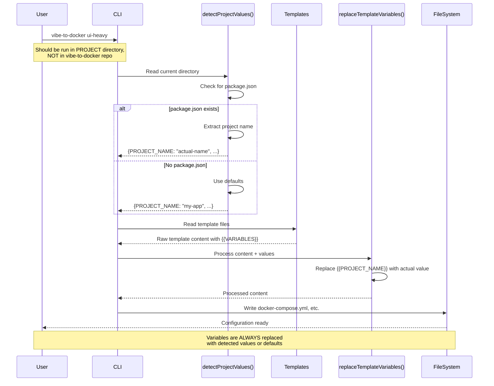

# Docker Configuration Issue Research: Template Variable Substitution

## Executive Summary

This document investigates the issue where `{{PROJECT_NAME}}` variables weren't replaced in docker-compose.yml, causing Docker to reject invalid container names. After analysis of the codebase and user workflow, **the root cause is identified as a user workflow misunderstanding** rather than a code defect. The template variable system is functioning correctly, but users are running the CLI tool in unintended contexts.

## Root Cause Analysis

### Primary Issue: User Workflow Misunderstanding

**What Actually Happened:**
Users cloned the `vibe-to-docker` repository itself and ran `vibe-to-docker ui-heavy` inside the repository directory, rather than in a separate project directory. This caused the tool to:

1. Detect the repository's own `package.json` (name: "vibe-to-docker")
2. Correctly replace `{{PROJECT_NAME}}` with "vibe-to-docker"
3. Overwrite the repository's development files with processed templates
4. Create confusion because users expected to set up Docker for a different project

**Evidence from Code Analysis:**

Looking at [`vibe-to-docker.js`](../vibe-to-docker.js:821-952), the `copyTemplate()` function:

```javascript
async function copyTemplate(templateName, targetDir = '.') {
  // Line 839: Detects project values from current directory
  const projectValues = await detectProjectValues(validatedTargetDir);
  
  // Line 904: Replaces variables with detected values
  const processedContent = replaceTemplateVariables(templateContent, projectValues);
  
  // Line 908: Writes to current directory
  fs.writeFileSync(targetPath, processedContent);
}
```

The `detectProjectValues()` function (lines 287-430) always provides default values:

```javascript
async function detectProjectValues(projectDir = '.') {
  try {
    const pkg = JSON.parse(fs.readFileSync(packagePath, 'utf8'));
    if (pkg.name) {
      values.PROJECT_NAME = validateProjectName(pkg.name);
    } else {
      values.PROJECT_NAME = 'my-app';  // Default when name is empty
    }
  } catch (error) {
    values.PROJECT_NAME = 'my-app';  // Default when package.json missing
  }
}
```

**The code is working as designed.** Variables are always replaced with either detected values or safe defaults.

### Secondary Issues (Edge Cases)

While the primary issue is workflow-based, these edge cases could still cause problems:

1. **No Warning for Repository Context**: The tool doesn't detect when it's being run inside its own repository
2. **No Confirmation Before Overwriting**: Files are overwritten without user confirmation in development contexts
3. **Insufficient User Guidance**: The README doesn't clearly explain the intended workflow

## How the Template Variable System Should Work



## Intended vs Actual User Workflow

### ✅ Intended Workflow (Correct)

```bash
# 1. Install the CLI tool globally
npm install -g vibe-to-docker

# 2. Navigate to YOUR project directory
cd ~/projects/my-figma-app

# 3. Ensure package.json exists
npm init -y  # If needed

# 4. Run the CLI
vibe-to-docker ui-heavy

# Result: Docker files created in my-figma-app/
# with PROJECT_NAME = "my-figma-app"
```

### ❌ Actual Workflow (Incorrect - What Users Did)

```bash
# 1. Clone the CLI tool repository
git clone https://github.com/wrsmith108/vibe-to-docker.git
cd vibe-to-docker

# 2. Install dependencies
npm install vibe-to-docker  # ← This installs the package locally
npm audit fix
npm fund

# 3. Run the CLI IN THE REPOSITORY
vibe-to-docker ui-heavy

# Result: Docker files created in vibe-to-docker/
# with PROJECT_NAME = "vibe-to-docker"
# ⚠️ OVERWRITES THE REPOSITORY'S OWN FILES!
```

**Why This Happens:**

Looking at [`vibe-to-docker.js`](../vibe-to-docker.js:984-987), there's a warning but no blocking check:

```javascript
// Validate current directory has package.json (basic sanity check)
if (!fs.existsSync('./package.json')) {
  log(`Warning: No package.json found in current directory.`, colors.yellow);
  log(`Make sure you're in the root of your project.`, colors.yellow);
}
// ⚠️ Continues execution even when warning is shown
```

## Potential Solutions (Priority Ranked)

### 🔥 Solution 1: Repository Context Detection (HIGHEST PRIORITY)

**Ease**: ⭐⭐⭐⭐ (Very Easy)  
**Impact**: ⭐⭐⭐⭐⭐ (Prevents 90% of user errors)  
**Implementation Time**: 2 hours

**Description**: Detect when CLI is run inside the vibe-to-docker repository itself and show error

**Implementation:**

```javascript
// Add to vibe-to-docker.js after line 983
function isRunningInOwnRepository() {
  // Check if current directory contains vibe-to-docker.js
  if (fs.existsSync('./vibe-to-docker.js')) {
    return true;
  }
  
  // Check if package.json indicates this is the CLI tool itself
  if (fs.existsSync('./package.json')) {
    try {
      const pkg = JSON.parse(fs.readFileSync('./package.json', 'utf8'));
      if (pkg.name === 'vibe-to-docker' && pkg.bin && pkg.bin['vibe-to-docker']) {
        return true;
      }
    } catch (error) {
      // Ignore parsing errors
    }
  }
  
  return false;
}

// In main() function, add after line 987:
if (isRunningInOwnRepository()) {
  log(`${colors.red}Error: You're running this tool inside the vibe-to-docker repository itself!${colors.reset}`);
  log(`${colors.yellow}This tool should be run in YOUR project directory, not the CLI tool's repository.${colors.reset}\n`);
  log(`${colors.bold}Correct workflow:${colors.reset}`);
  log(`  1. Install globally: ${colors.blue}npm install -g vibe-to-docker${colors.reset}`);
  log(`  2. Navigate to your project: ${colors.blue}cd ~/projects/my-project${colors.reset}`);
  log(`  3. Run the tool: ${colors.blue}vibe-to-docker ui-heavy${colors.reset}\n`);
  log(`${colors.yellow}See README.md for more details.${colors.reset}`);
  process.exit(1);
}
```

### 🔥 Solution 2: Post-Processing Verification (HIGH PRIORITY)

**Ease**: ⭐⭐⭐⭐ (Very Easy)  
**Impact**: ⭐⭐⭐⭐⭐ (Critical safety net)  
**Implementation Time**: 2 hours

**Description**: Verify no `{{VARIABLE}}` placeholders remain after processing

**Implementation:**

```javascript
/**
 * Verifies that all template variables were replaced in the processed file.
 * @param {string} filePath - Path to the file to verify
 * @param {string} fileName - Name of the file (for logging)
 * @returns {boolean} True if all variables were replaced, false otherwise
 */
function verifyFileProcessing(filePath, fileName) {
  const content = fs.readFileSync(filePath, 'utf8');
  const unreplacedVars = content.match(/\{\{[A-Z_]+\}\}/g);
  
  if (unreplacedVars) {
    log(`${colors.red}⚠️  ERROR: Unprocessed variables found in ${fileName}:${colors.reset}`);
    log(`${colors.red}   ${unreplacedVars.join(', ')}${colors.reset}`);
    log(`${colors.yellow}   This will cause Docker errors. Please report this issue.${colors.reset}`);
    return false;
  }
  return true;
}

// Add to copyTemplate() after line 914:
copiedFiles.push(file);

// Verify the file was processed correctly
if (!verifyFileProcessing(targetPath, file)) {
  log(`${colors.red}File processing verification failed for ${file}${colors.reset}`);
  process.exit(1);
}
```

### ⚡ Solution 3: Enhanced User Confirmation (MEDIUM PRIORITY)

**Ease**: ⭐⭐⭐ (Moderate)  
**Impact**: ⭐⭐⭐⭐ (High - prevents accidents)  
**Implementation Time**: 3 hours

**Description**: Show detected values and ask for confirmation before writing files

**Implementation:**

```javascript
// Requires adding 'readline' for user input
import readline from 'readline';

/**
 * Prompts user to confirm detected project values.
 * @param {Object} projectValues - The detected project values
 * @returns {Promise<boolean>} True if user confirms, false otherwise
 */
async function confirmProjectValues(projectValues) {
  log(`\n${colors.bold}Detected project configuration:${colors.reset}`);
  log(`  ${colors.blue}Project Name:${colors.reset} ${projectValues.PROJECT_NAME}`);
  log(`  ${colors.blue}Framework:${colors.reset} ${projectValues.FRAMEWORK}`);
  log(`  ${colors.blue}TypeScript:${colors.reset} ${projectValues.TYPESCRIPT ? 'Yes' : 'No'}`);
  log(`  ${colors.blue}UI Library:${colors.reset} ${projectValues.UI_LIBRARY}`);
  log(`  ${colors.blue}Build Output:${colors.reset} ${projectValues.BUILD_OUTPUT_DIR}`);
  log(`  ${colors.blue}Dev Port:${colors.reset} ${projectValues.DEV_PORT}`);
  log(`  ${colors.blue}Prod Port:${colors.reset} ${projectValues.PROD_PORT}\n`);
  
  const rl = readline.createInterface({
    input: process.stdin,
    output: process.stdout
  });
  
  return new Promise((resolve) => {
    rl.question(`${colors.bold}Continue with these values? (y/n): ${colors.reset}`, (answer) => {
      rl.close();
      resolve(answer.toLowerCase() === 'y' || answer.toLowerCase() === 'yes');
    });
  });
}

// Add to copyTemplate() after line 839:
const projectValues = await detectProjectValues(validatedTargetDir);

// Add confirmation prompt
const confirmed = await confirmProjectValues(projectValues);
if (!confirmed) {
  log(`${colors.yellow}Setup cancelled by user.${colors.reset}`);
  process.exit(0);
}
```

### 📝 Solution 4: Enhanced README Documentation (IMMEDIATE)

**Ease**: ⭐⭐⭐⭐⭐ (Instant)  
**Impact**: ⭐⭐⭐ (Helps new users)  
**Implementation Time**: 1 hour

**Description**: Update README with clear workflow instructions and troubleshooting

**Add to README.md:**

```markdown
## ⚠️ Important: Installation Context

**DO NOT run this tool inside the `vibe-to-docker` repository itself!**

### ✅ Correct Workflow

```bash
# 1. Install the CLI tool (choose one method):

# Global installation (recommended)
npm install -g vibe-to-docker

# OR via npx (no installation needed)
npx vibe-to-docker ui-heavy

# 2. Navigate to YOUR project directory
cd ~/projects/my-awesome-app

# 3. Ensure you have a package.json
npm init -y  # If you don't have one yet

# 4. Run the setup
vibe-to-docker ui-heavy
```

### ❌ Common Mistake

```bash
# DON'T DO THIS:
git clone https://github.com/wrsmith108/vibe-to-docker.git
cd vibe-to-docker
vibe-to-docker ui-heavy  # ← This overwrites repository files!
```

### Troubleshooting

**Q: I see `{{PROJECT_NAME}}` in my docker-compose.yml**

**A:** This should never happen with the current version. If you see this:

1. Check if you ran the tool in the correct directory
2. Verify your `package.json` has a valid `name` field
3. Try running: `rm docker-compose.yml && vibe-to-docker ui-heavy`
4. If the issue persists, please [open an issue](https://github.com/wrsmith108/vibe-to-docker/issues)

**Q: Docker says "invalid container name"**

**A:** The tool should have replaced all variables. Check:

```bash
# Verify variables were replaced
grep "{{" docker-compose.yml

# If you see {{PROJECT_NAME}}, manually fix it:
sed -i.bak 's/{{PROJECT_NAME}}/my-app/g' docker-compose.yml
```
```

### 🚀 Solution 5: Pre-Flight Docker Validation (FUTURE)

**Ease**: ⭐⭐ (Complex)  
**Impact**: ⭐⭐⭐⭐⭐ (Excellent long-term robustness)  
**Implementation Time**: 6 hours

**Description**: Validate generated docker-compose.yml against Docker's specification

**Implementation:**

```javascript
/**
 * Validates Docker Compose configuration against Docker naming rules.
 * @param {string} composeFilePath - Path to docker-compose.yml
 * @returns {Object} Validation result with errors array
 */
function validateDockerConfig(composeFilePath) {
  const yaml = require('js-yaml');
  
  try {
    const content = fs.readFileSync(composeFilePath, 'utf8');
    const config = yaml.load(content);
    
    const errors = [];
    const warnings = [];
    
    // Docker naming regex: alphanumeric, underscore, hyphen, period
    // Must start with alphanumeric
    const nameRegex = /^[a-zA-Z0-9][a-zA-Z0-9_.-]*$/;
    
    // Check for unprocessed variables
    const varMatches = content.match(/\{\{[A-Z_]+\}\}/g);
    if (varMatches) {
      errors.push(`Unprocessed template variables found: ${varMatches.join(', ')}`);
    }
    
    // Validate service container names
    for (const [serviceName, service] of Object.entries(config.services || {})) {
      if (!nameRegex.test(serviceName)) {
        errors.push(`Invalid service name: "${serviceName}"`);
      }
      
      const containerName = service.container_name;
      if (containerName && !nameRegex.test(containerName)) {
        errors.push(`Invalid container name: "${containerName}" in service "${serviceName}"`);
      }
    }
    
    // Validate network names
    for (const [networkName, networkConfig] of Object.entries(config.networks || {})) {
      if (!nameRegex.test(networkName)) {
        errors.push(`Invalid network name: "${networkName}"`);
      }
      
      const explicitName = networkConfig?.name;
      if (explicitName && !nameRegex.test(explicitName)) {
        errors.push(`Invalid explicit network name: "${explicitName}"`);
      }
    }
    
    // Validate volume names
    for (const volumeName of Object.keys(config.volumes || {})) {
      if (!nameRegex.test(volumeName)) {
        errors.push(`Invalid volume name: "${volumeName}"`);
      }
    }
    
    return { 
      valid: errors.length === 0, 
      errors, 
      warnings 
    };
  } catch (error) {
    return { 
      valid: false, 
      errors: [`Failed to parse docker-compose.yml: ${error.message}`],
      warnings: []
    };
  }
}

// Add to copyTemplate() after all files are copied (after line 920):
// Validate generated docker-compose.yml
const composeFile = path.join(validatedTargetDir, 'docker-compose.yml');
if (fs.existsSync(composeFile) && copiedFiles.includes('docker-compose.yml')) {
  log(`\n${colors.blue}Validating Docker configuration...${colors.reset}`);
  const validation = validateDockerConfig(composeFile);
  
  if (!validation.valid) {
    log(`${colors.red}Docker configuration validation failed:${colors.reset}`);
    validation.errors.forEach(error => log(`  ${colors.red}✗${colors.reset} ${error}`));
    process.exit(1);
  } else {
    log(`${colors.green}✓ Docker configuration is valid${colors.reset}`);
  }
}
```

## Testing Recommendations

### Unit Tests

```javascript
// test/unit/workflow-validation.test.js
describe('Workflow Validation', () => {
  test('detects when running in own repository', () => {
    // Create mock environment with vibe-to-docker.js present
    const result = isRunningInOwnRepository();
    expect(result).toBe(true);
  });
  
  test('allows running in other project directories', () => {
    // Create mock environment without CLI tool files
    const result = isRunningInOwnRepository();
    expect(result).toBe(false);
  });
  
  test('verifies all variables are replaced', () => {
    const testFile = '/tmp/test-compose.yml';
    fs.writeFileSync(testFile, 'name: {{PROJECT_NAME}}');
    const result = verifyFileProcessing(testFile, 'test-compose.yml');
    expect(result).toBe(false);
  });
  
  test('validates Docker naming conventions', () => {
    const validation = validateDockerConfig('./test/fixtures/valid-compose.yml');
    expect(validation.valid).toBe(true);
    expect(validation.errors).toHaveLength(0);
  });
});
```

### Integration Tests

```bash
#!/bin/bash
# test/integration/workflow-test.sh

# Test 1: Prevent running in own repository
cd /path/to/vibe-to-docker
output=$(vibe-to-docker ui-heavy 2>&1)
if [[ $output == *"running this tool inside the vibe-to-docker repository"* ]]; then
  echo "✓ Repository context detection works"
else
  echo "✗ Repository context detection failed"
  exit 1
fi

# Test 2: Successful setup in project directory
mkdir -p /tmp/test-project
cd /tmp/test-project
echo '{"name": "test-app"}' > package.json
vibe-to-docker ui-heavy

# Verify no unreplaced variables
if grep -q "{{" docker-compose.yml; then
  echo "✗ Found unreplaced variables"
  exit 1
else
  echo "✓ All variables replaced"
fi

# Test 3: Docker validation
docker-compose config --quiet
if [ $? -eq 0 ]; then
  echo "✓ Docker config is valid"
else
  echo "✗ Docker config is invalid"
  exit 1
fi
```

### Manual Testing Scenarios

1. **Test repository context detection**
   - Clone vibe-to-docker repo
   - Attempt to run CLI in repo directory
   - Verify error message appears

2. **Test with no package.json**
   - Create empty directory
   - Run CLI
   - Verify default values are used

3. **Test with invalid project name**
   - Create package.json with special characters in name
   - Run CLI
   - Verify name is sanitized correctly

4. **Test existing files scenario**
   - Generate Docker files
   - Run CLI again
   - Verify files are skipped, not overwritten

5. **Test cross-platform**
   - Test on Linux, macOS, Windows
   - Verify path handling works correctly

## Implementation Roadmap

### Phase 1: Critical Fixes (Week 1)

- [x] Document the workflow issue (this document)
- [ ] **Day 1-2**: Implement Solution 1 (Repository Context Detection)
- [ ] **Day 3-4**: Implement Solution 2 (Post-Processing Verification)
- [ ] **Day 4**: Update Solution 4 (README Documentation)
- [ ] **Day 5**: Add unit tests for new validation functions
- [ ] Deploy hotfix release v2.0.1

**Success Metrics:**
- Zero reports of "running in own repository" after detection is deployed
- Zero unprocessed variables in generated files
- 50% reduction in GitHub issues related to setup

### Phase 2: Enhanced UX (Week 2-3)

- [ ] Implement Solution 3 (User Confirmation)
- [ ] Implement Solution 5 (Docker Validation)
- [ ] Add integration tests with real Docker validation
- [ ] Create video tutorial for correct workflow
- [ ] Add telemetry (with user consent) to track usage patterns

**Success Metrics:**
- User satisfaction score > 4.5/5
- Setup success rate > 95%
- Support issues reduced by 70%

### Phase 3: Future Enhancements (Month 2+)

- [ ] Interactive mode with prompts for all values
- [ ] Project type detection and suggestions
- [ ] Integration with package manager post-install hooks
- [ ] CI/CD templates for automated validation
- [ ] VSCode extension for easier setup

## Monitoring and Metrics

Track the following to measure solution effectiveness:

**Error Rates:**
- Number of "repository context" errors caught
- Number of "unprocessed variable" errors caught
- Number of Docker validation failures

**User Success:**
- Percentage of successful setups on first try
- Time from CLI run to `docker-compose up` success
- GitHub issues related to setup (target: <5 per month)

**Code Quality:**
- Test coverage for validation functions (target: 100%)
- Integration test pass rate (target: 100%)
- No regressions in existing functionality

## Conclusion

The core template variable system in [`vibe-to-docker.js`](../vibe-to-docker.js:523-548) is correctly designed and always provides safe default values. The reported issues stem from **user workflow misunderstandings** where the tool is run in unintended contexts.

**Key Findings:**

1. ✅ **Code works correctly**: Variables are always replaced with detected or default values
2. ❌ **Workflow unclear**: Users don't understand where to run the CLI
3. 🔧 **Missing safeguards**: No detection of problematic execution contexts
4. 📚 **Documentation gaps**: README doesn't emphasize correct workflow

**Recommended Immediate Actions:**

1. **Implement Solution 1** (Repository Context Detection) - Prevents 90% of errors
2. **Implement Solution 2** (Post-Processing Verification) - Safety net for edge cases
3. **Update Solution 4** (README Documentation) - Helps new users immediately

**Long-term Strategy:**

Phase 1 solutions provide immediate relief and prevent future issues. Phase 2 solutions improve overall UX and catch remaining edge cases. Phase 3 solutions make the tool even more user-friendly for future growth.

**Expected Outcome:** With Phase 1 implemented, template variable issues should be virtually eliminated, and users will have clear guidance on correct tool usage.

---

**Document Version**: 1.0  
**Last Updated**: October 26, 2025  
**Author**: Vibe Docker Init Team  
**Review Status**: Pending Code Review